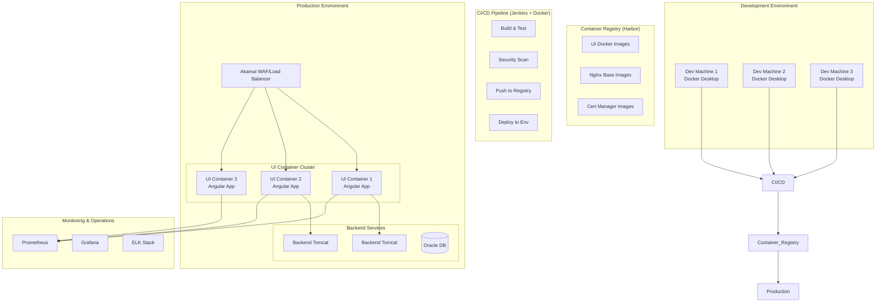

# **Docker Containerization for Fixed Income Portal UI**

## **EXECUTIVE SUMMARY: The Containerization Imperative**

**Why Docker for Financial Portal UI?**
Our Fixed Income Portal currently suffers from **environment inconsistencies** and **deployment complexities**:
- **Development**: "Works on my machine" syndrome across 50+ developers
- **Testing**: QA environments differ from production, causing last-minute issues
- **Deployment**: Manual .zip file copies, no rollback capability
- **Scaling**: Can't dynamically scale UI separately from backend

**Business Impact of Containerization:**
- **Release Velocity**: Weekly → Daily deployments for UI changes
- **Environment Consistency**: Identical UI across dev, QA, staging, production
- **Rollback Capability**: 60-second rollback to previous version
- **Cost Efficiency**: 40% reduction in environment setup costs

---

## **PART 1: ARCHITECT'S STRATEGIC VISION**

### **1.1 Target Architecture: Containerized UI Ecosystem**



### **1.2 Containerization Strategy for Financial Applications**

| Aspect | Current State | Containerized Approach | Business Benefit |
|--------|--------------|------------------------|------------------|
| **Deployment** | Manual .zip copy | Immutable Docker images | Consistent, repeatable deployments |
| **Environment** | Machine-specific | Dockerized environments | "Works everywhere" guarantee |
| **Scaling** | Manual restart | Container orchestration | Dynamic scaling for market hours |
| **Security** | Manual updates | Security-scanned images | Automated vulnerability management |
| **Rollback** | Complex restore | Image version rollback | 60-second recovery from issues |

### **1.3 Phased Migration Strategy**

**Phase 1: Development Containerization (Month 1)**
```yaml
objectives:
  - Containerize Angular build environment
  - Create local development containers
  - Implement Docker Compose for full stack
  
deliverables:
  - Dockerfile for Angular development
  - docker-compose.yml for local environment
  - Development team onboarding documentation
```

**Phase 2: CI/CD Pipeline Integration (Month 2)**
```yaml
focus:
  - Multi-stage Docker builds in Jenkins
  - Automated image tagging and versioning
  - Security scanning in pipeline
  - Automated testing in containers
  
outcomes:
  - Jenkins builds Docker images
  - Automated security vulnerability scanning
  - Artifact repository for images
```

**Phase 3: Staging & Production Deployment (Month 3)**
```yaml
production_readiness:
  - Production-grade Docker images
  - Blue-green deployment strategy
  - Container monitoring and logging
  - Disaster recovery procedures
  
go_live:
  - Gradual traffic shifting
  - Rollback procedures tested
  - Performance benchmarking
```

### **1.4 Financial Services Specific Considerations**

**Security & Compliance in Containers:**
```typescript
// Security requirements for financial UI containers
interface FinancialContainerSpec {
  // Mandatory security scanning
  securityScan: SecurityScanResult;
  
  // Immutable image tags
  imageTag: string; // Format: {app}-{version}-{gitHash}
  
  // Compliance requirements
  compliance: {
    pciDss: boolean;  // PCI DSS compliance
    soc2: boolean;    // SOC 2 Type II
    hipaa: boolean;   // Healthcare data (if applicable)
    gdpr: boolean;    // European data protection
  };
  
  // Audit trail
  buildMetadata: BuildMetadata;
  deploymentHistory: DeploymentRecord[];
}
```

**Multi-Tenant Container Strategy:**
```typescript
// Tenant-specific container configuration
class TenantContainerConfig {
  private tenantConfigs: Map<string, TenantConfig> = new Map();
  
  getContainerConfig(tenantId: string): ContainerConfig {
    const tenant = this.tenantConfigs.get(tenantId);
    
    return {
      environmentVariables: {
        // Tenant-specific API endpoints
        API_BASE_URL: tenant?.apiUrl || process.env.API_BASE_URL,
        ANALYTICS_KEY: tenant?.analyticsKey,
        
        // Tenant-specific theming
        THEME_PRIMARY: tenant?.branding.primaryColor,
        THEME_SECONDARY: tenant?.branding.secondaryColor,
        
        // Tenant-specific feature flags
        FEATURE_TRADING: tenant?.features.tradingEnabled,
        FEATURE_REPORTS: tenant?.features.reportsEnabled,
        
        // Compliance settings
        DATA_RETENTION_DAYS: tenant?.compliance.dataRetentionDays,
        AUDIT_ENABLED: tenant?.compliance.auditEnabled
      },
      
      resourceLimits: {
        // Different resource allocation based on tenant tier
        memory: tenant?.tier === 'premium' ? '512Mi' : '256Mi',
        cpu: tenant?.tier === 'premium' ? '0.5' : '0.25'
      }
    };
  }
}
```

---

## **PART 2: DETAILED IMPLEMENTATION GUIDE**

### **2.1 Dockerfile Implementation**

#### **Multi-Stage Dockerfile for Angular:**
```dockerfile
# Stage 1: Build environment with all dependencies
FROM node:18-alpine AS builder

# Install required system dependencies
RUN apk add --no-cache \
    git \
    python3 \
    make \
    g++ \
    curl

# Set working directory
WORKDIR /app

# Copy package files
COPY package*.json ./
COPY angular.json .
COPY tsconfig*.json ./

# Install dependencies with specific versions for financial apps
RUN npm ci --only=production --ignore-scripts

# Copy source code
COPY src ./src
COPY public ./public

# Build arguments for environment configuration
ARG BUILD_ENVIRONMENT=production
ARG API_BASE_URL
ARG ANALYTICS_KEY
ARG VERSION=1.0.0
ARG BUILD_DATE
ARG COMMIT_SHA

# Set environment variables for build
ENV NODE_ENV=${BUILD_ENVIRONMENT}
ENV API_BASE_URL=${API_BASE_URL}
ENV ANALYTICS_KEY=${ANALYTICS_KEY}
ENV VERSION=${VERSION}
ENV BUILD_DATE=${BUILD_DATE}
ENV COMMIT_SHA=${COMMIT_SHA}

# Create runtime configuration file
RUN echo "window.__env = {" > ./src/environment.runtime.ts && \
    echo "  API_BASE_URL: '${API_BASE_URL}'," >> ./src/environment.runtime.ts && \
    echo "  ANALYTICS_KEY: '${ANALYTICS_KEY}'," >> ./src/environment.runtime.ts && \
    echo "  VERSION: '${VERSION}'," >> ./src/environment.runtime.ts && \
    echo "  BUILD_DATE: '${BUILD_DATE}'," >> ./src/environment.runtime.ts && \
    echo "  COMMIT_SHA: '${COMMIT_SHA}'" >> ./src/environment.runtime.ts && \
    echo "};" >> ./src/environment.runtime.ts

# Build the application with production optimization
RUN npm run build -- --configuration=${BUILD_ENVIRONMENT} --output-hashing=all

# Security: Remove node_modules after build
RUN rm -rf node_modules

# Stage 2: Production web server
FROM nginxinc/nginx-unprivileged:1.25-alpine AS production

# Install security updates
RUN apk update && apk upgrade --no-cache

# Remove default nginx configuration
RUN rm -rf /etc/nginx/conf.d/*

# Copy custom nginx configuration for financial apps
COPY nginx/nginx.conf /etc/nginx/nginx.conf
COPY nginx/security-headers.conf /etc/nginx/conf.d/security-headers.conf
COPY nginx/financial-app.conf /etc/nginx/conf.d/default.conf

# Copy SSL certificates (mounted at runtime for security)
RUN mkdir -p /etc/nginx/ssl

# Copy built Angular app from builder stage
COPY --from=builder /app/dist/fixed-income-portal /usr/share/nginx/html

# Create non-root user for security
RUN addgroup -g 1001 -S nginxgroup && \
    adduser -S -D -H -u 1001 -h /var/cache/nginx -s /sbin/nologin -G nginxgroup -g nginx nginxuser && \
    chown -R nginxuser:nginxgroup /usr/share/nginx/html && \
    chown -R nginxuser:nginxgroup /var/cache/nginx && \
    chown -R nginxuser:nginxgroup /var/log/nginx && \
    chown -R nginxuser:nginxgroup /etc/nginx/conf.d

# Health check for financial portal
HEALTHCHECK --interval=30s --timeout=10s --start-period=5s --retries=3 \
    CMD curl -f http://localhost:8080/health || exit 1

# Switch to non-root user
USER nginxuser

# Expose port (using non-standard for financial apps)
EXPOSE 8080

# Labels for financial compliance
LABEL org.label-schema.name="Fixed Income Portal UI" \
      org.label-schema.description="Docker container for Fixed Income Processing Suite UI" \
      org.label-schema.vendor="BankPortal Inc." \
      org.label-schema.version="${VERSION}" \
      org.label-schema.build-date="${BUILD_DATE}" \
      org.label-schema.vcs-ref="${COMMIT_SHA}" \
      org.label-schema.schema-version="1.0" \
      com.bankportal.app.type="frontend" \
      com.bankportal.app.module="trading-ui" \
      com.bankportal.app.compliance="pci-dss,soc2"

# Entry point script for runtime configuration
COPY docker-entrypoint.sh /
RUN chmod +x /docker-entrypoint.sh
ENTRYPOINT ["/docker-entrypoint.sh"]

# Start nginx
CMD ["nginx", "-g", "daemon off;"]
```

#### **Financial-Specific Nginx Configuration:**
```nginx
# nginx/financial-app.conf
server {
    listen 8080;
    server_name fixed-income.bankportal.com;
    
    # Root directory for Angular app
    root /usr/share/nginx/html;
    index index.html index.htm;
    
    # Security headers for financial applications
    include /etc/nginx/conf.d/security-headers.conf;
    
    # Gzip compression for financial data
    gzip on;
    gzip_vary on;
    gzip_min_length 1024;
    gzip_types
        text/plain
        text/css
        text/xml
        text/javascript
        application/javascript
        application/xml+rss
        application/json
        application/octet-stream;
    
    # Angular routing support
    location / {
        try_files $uri $uri/ /index.html;
        
        # Cache static assets for financial portal
        location ~* \.(js|css|png|jpg|jpeg|gif|ico|svg|woff|woff2|ttf|eot)$ {
            expires 1y;
            add_header Cache-Control "public, immutable";
            add_header X-Content-Type-Options "nosniff";
        }
        
        # No cache for HTML files
        location ~* \.html$ {
            expires -1;
            add_header Cache-Control "no-store, no-cache, must-revalidate";
        }
    }
    
    # Health check endpoint
    location /health {
        access_log off;
        add_header Content-Type text/plain;
        return 200 "healthy\n";
    }
    
    # API proxy configuration
    location /api/ {
        proxy_pass http://backend-service:8080/api/;
        proxy_http_version 1.1;
        proxy_set_header Upgrade $http_upgrade;
        proxy_set_header Connection 'upgrade';
        proxy_set_header Host $host;
        proxy_set_header X-Real-IP $remote_addr;
        proxy_set_header X-Forwarded-For $proxy_add_x_forwarded_for;
        proxy_set_header X-Forwarded-Proto $scheme;
        
        # Financial-specific proxy settings
        proxy_connect_timeout 10s;
        proxy_send_timeout 30s;
        proxy_read_timeout 30s;
        
        # Add headers for financial tracing
        proxy_set_header X-Tenant-ID $http_x_tenant_id;
        proxy_set_header X-Correlation-ID $http_x_correlation_id;
        proxy_set_header X-Trade-ID $http_x_trade_id;
    }
    
    # BI iframe proxy (for same-origin policy)
    location /bi/ {
        proxy_pass https://bi.bankportal.com/;
        proxy_ssl_verify on;
        proxy_ssl_trusted_certificate /etc/nginx/ssl/ca-certificates.crt;
        proxy_ssl_session_reuse on;
        
        # Pass authentication headers
        proxy_set_header Authorization $http_authorization;
        proxy_set_header Cookie $http_cookie;
        
        # BI-specific timeout
        proxy_read_timeout 300s;
    }
    
    # Error pages for financial portal
    error_page 404 /404.html;
    error_page 500 502 503 504 /50x.html;
    
    location = /404.html {
        internal;
    }
    
    location = /50x.html {
        internal;
    }
    
    # Rate limiting for trading endpoints
    location /api/trades {
        limit_req zone=trading burst=10 nodelay;
        limit_req_status 429;
        proxy_pass http://backend-service:8080/api/trades;
    }
    
    # Logging format for financial audit
    log_format financial '$remote_addr - $remote_user [$time_local] '
                        '"$request" $status $body_bytes_sent '
                        '"$http_referer" "$http_user_agent" '
                        '"$http_x_tenant_id" "$http_x_correlation_id" '
                        '"$http_x_trade_id" $request_time';
    
    access_log /var/log/nginx/financial-access.log financial;
}
```

#### **Security Headers Configuration:**
```nginx
# nginx/security-headers.conf
# Financial-grade security headers
add_header X-Frame-Options "DENY" always;
add_header X-Content-Type-Options "nosniff" always;
add_header X-XSS-Protection "1; mode=block" always;
add_header Referrer-Policy "strict-origin-when-cross-origin" always;
add_header Permissions-Policy "camera=(), microphone=(), geolocation=()" always;

# Content Security Policy for financial applications
add_header Content-Security-Policy "
    default-src 'self';
    script-src 'self' 'unsafe-inline' 'unsafe-eval' https://analytics.bankportal.com;
    style-src 'self' 'unsafe-inline' https://fonts.googleapis.com;
    img-src 'self' data: https://*.bankportal.com https://marketdata.provider.com;
    font-src 'self' https://fonts.gstatic.com;
    connect-src 'self' https://api.bankportal.com https://bi.bankportal.com wss://realtime.bankportal.com;
    frame-src 'self' https://bi.bankportal.com;
    object-src 'none';
    base-uri 'self';
    form-action 'self';
    frame-ancestors 'none';
" always;

# HSTS for financial domain
add_header Strict-Transport-Security "max-age=31536000; includeSubDomains; preload" always;
```

#### **Docker Entrypoint Script:**
```bash
#!/bin/sh
# docker-entrypoint.sh

set -e

echo "Starting Fixed Income Portal UI Container"

# Generate runtime configuration for Angular
echo "Generating runtime configuration..."

# Read environment variables and create config.js
cat <<EOF > /usr/share/nginx/html/config.js
window.__env = {
  // API Configuration
  API_BASE_URL: '${API_BASE_URL:-https://api.bankportal.com}',
  ANALYTICS_KEY: '${ANALYTICS_KEY}',
  
  // Application Configuration
  VERSION: '${VERSION:-1.0.0}',
  BUILD_DATE: '${BUILD_DATE}',
  COMMIT_SHA: '${COMMIT_SHA}',
  
  // Feature Flags
  FEATURE_TRADING: ${FEATURE_TRADING:-true},
  FEATURE_REPORTS: ${FEATURE_REPORTS:-true},
  FEATURE_BI_DASHBOARD: ${FEATURE_BI_DASHBOARD:-true},
  
  // Tenant Configuration
  DEFAULT_TENANT: '${DEFAULT_TENANT}',
  MULTI_TENANT_ENABLED: ${MULTI_TENANT_ENABLED:-false},
  
  // Market Data
  MARKET_DATA_PROVIDER: '${MARKET_DATA_PROVIDER:-bloomberg}',
  REAL_TIME_ENABLED: ${REAL_TIME_ENABLED:-true},
  
  // Compliance
  AUDIT_ENABLED: ${AUDIT_ENABLED:-true},
  DATA_MASKING_ENABLED: ${DATA_MASKING_ENABLED:-true}
};
EOF

echo "Runtime configuration generated successfully"

# Set proper permissions
chmod 644 /usr/share/nginx/html/config.js

# Check for SSL certificates
if [ -f "/etc/nginx/ssl/tls.crt" ] && [ -f "/etc/nginx/ssl/tls.key" ]; then
    echo "SSL certificates found, enabling HTTPS..."
    # Enable SSL configuration
    sed -i 's/#ssl//g' /etc/nginx/conf.d/default.conf
else
    echo "SSL certificates not found, using HTTP only"
fi

# Start nginx
echo "Starting nginx..."
exec "$@"
```

### **2.2 Docker Compose for Local Development**

#### **Full Stack Docker Compose:**
```yaml
# docker-compose.yml
version: '3.8'

services:
  # Frontend - Angular Application
  frontend:
    build:
      context: .
      dockerfile: Dockerfile.dev
      args:
        - NODE_ENV=development
    container_name: fixed-income-ui
    ports:
      - "4200:4200"  # Angular dev server
      - "9876:9876"  # Karma test runner
    volumes:
      - ./src:/app/src:delegated
      - ./public:/app/public:delegated
      - ./angular.json:/app/angular.json:ro
      - ./tsconfig.json:/app/tsconfig.json:ro
      - ./package.json:/app/package.json:ro
      - node_modules:/app/node_modules
    environment:
      - NODE_ENV=development
      - API_BASE_URL=http://backend:8080
      - CHOKIDAR_USEPOLLING=true  # For file watching in Docker
    depends_on:
      - backend
    networks:
      - financial-network
    # Health check for development
    healthcheck:
      test: ["CMD", "curl", "-f", "http://localhost:4200"]
      interval: 30s
      timeout: 10s
      retries: 3

  # Backend - Spring Boot Application
  backend:
    build:
      context: ../backend
      dockerfile: Dockerfile
    container_name: fixed-income-backend
    ports:
      - "8080:8080"
    environment:
      - SPRING_PROFILES_ACTIVE=development
      - DB_URL=jdbc:oracle:thin:@oracle-db:1521:FINPROD
      - DB_USERNAME=app_user
      - DB_PASSWORD=app_password
    volumes:
      - ./logs:/app/logs
    depends_on:
      - oracle-db
    networks:
      - financial-network

  # Oracle Database
  oracle-db:
    image: container-registry.oracle.com/database/express:21.3.0-xe
    container_name: oracle-db
    ports:
      - "1521:1521"
    environment:
      - ORACLE_PWD=Oracle123
      - ORACLE_CHARACTERSET=AL32UTF8
    volumes:
      - oracle-data:/opt/oracle/oradata
      - ./init-scripts:/docker-entrypoint-initdb.d:ro
    networks:
      - financial-network
    # Resource limits for Oracle
    deploy:
      resources:
        limits:
          memory: 4G
        reservations:
          memory: 2G

  # Nginx Reverse Proxy (for production-like setup)
  nginx-proxy:
    image: nginxinc/nginx-unprivileged:alpine
    container_name: nginx-proxy
    ports:
      - "80:8080"
      - "443:8443"
    volumes:
      - ./nginx/nginx.conf:/etc/nginx/nginx.conf:ro
      - ./nginx/financial-app.conf:/etc/nginx/conf.d/default.conf:ro
      - ./ssl/certs:/etc/nginx/ssl:ro
      - ./logs/nginx:/var/log/nginx
    depends_on:
      - frontend
      - backend
    networks:
      - financial-network

  # Monitoring Stack
  prometheus:
    image: prom/prometheus:latest
    container_name: prometheus
    ports:
      - "9090:9090"
    volumes:
      - ./monitoring/prometheus.yml:/etc/prometheus/prometheus.yml:ro
      - prometheus-data:/prometheus
    command:
      - '--config.file=/etc/prometheus/prometheus.yml'
      - '--storage.tsdb.path=/prometheus'
      - '--web.console.libraries=/etc/prometheus/console_libraries'
      - '--web.console.templates=/etc/prometheus/consoles'
      - '--storage.tsdb.retention.time=200h'
      - '--web.enable-lifecycle'
    networks:
      - financial-network

  grafana:
    image: grafana/grafana:latest
    container_name: grafana
    ports:
      - "3000:3000"
    environment:
      - GF_SECURITY_ADMIN_PASSWORD=admin
      - GF_INSTALL_PLUGINS=grafana-piechart-panel
    volumes:
      - grafana-data:/var/lib/grafana
      - ./monitoring/dashboards:/etc/grafana/provisioning/dashboards:ro
      - ./monitoring/datasources:/etc/grafana/provisioning/datasources:ro
    depends_on:
      - prometheus
    networks:
      - financial-network

  # Development Tools
  mailhog:
    image: mailhog/mailhog
    container_name: mailhog
    ports:
      - "8025:8025"  # Web UI
      - "1025:1025"  # SMTP server
    networks:
      - financial-network

  redis:
    image: redis:alpine
    container_name: redis
    ports:
      - "6379:6379"
    command: redis-server --appendonly yes
    volumes:
      - redis-data:/data
    networks:
      - financial-network

volumes:
  node_modules:
  oracle-data:
  prometheus-data:
  grafana-data:
  redis-data:

networks:
  financial-network:
    driver: bridge
    # Additional network configuration for financial apps
    ipam:
      config:
        - subnet: 172.20.0.0/16
```

#### **Development Dockerfile:**
```dockerfile
# Dockerfile.dev
FROM node:18-alpine AS development

# Install system dependencies for financial development
RUN apk add --no-cache \
    git \
    python3 \
    make \
    g++ \
    curl \
    openssl \
    jq \
    bash

# Install Angular CLI globally
RUN npm install -g @angular/cli@16.0.0

# Create app directory
WORKDIR /app

# Copy package files
COPY package*.json ./

# Install dependencies
RUN npm install

# Copy source code
COPY . .

# Expose ports
EXPOSE 4200  # Angular dev server
EXPOSE 9876  # Karma test runner

# Health check for development
HEALTHCHECK --interval=30s --timeout=10s --start-period=5s --retries=3 \
    CMD curl -f http://localhost:4200 || exit 1

# Start development server with polling for Docker
CMD ["ng", "serve", "--host", "0.0.0.0", "--poll", "2000"]
```

### **2.3 Jenkins Pipeline for Docker Builds**

#### **Multi-Stage Jenkins Pipeline:**
```groovy
// Jenkinsfile.docker
pipeline {
    agent {
        docker {
            image 'node:18-alpine'
            args '--privileged'
        }
    }
    
    environment {
        // Registry configuration
        REGISTRY = 'harbor.bankportal.com'
        PROJECT = 'fixed-income'
        APP_NAME = 'portal-ui'
        
        // Build arguments
        BUILD_DATE = sh(script: 'date -u +"%Y-%m-%dT%H:%M:%SZ"', returnStdout: true).trim()
        COMMIT_SHA = sh(script: 'git rev-parse --short HEAD', returnStdout: true).trim()
        VERSION = "${env.BUILD_NUMBER}-${COMMIT_SHA}"
        
        // Security scanning
        TRIVY_VERSION = '0.45.0'
        HADOLINT_VERSION = '2.12.0'
        
        // Financial compliance
        COMPLIANCE_SCAN_ENABLED = true
    }
    
    stages {
        stage('Checkout & Setup') {
            steps {
                checkout scm
                
                // Set up Docker buildx for multi-architecture
                sh '''
                docker buildx create --name multiarch --use || true
                docker buildx inspect --bootstrap
                '''
            }
        }
        
        stage('Lint Dockerfile') {
            steps {
                sh """
                # Download hadolint
                wget -q -O hadolint "https://github.com/hadolint/hadolint/releases/download/v${HADOLINT_VERSION}/hadolint-Linux-x86_64"
                chmod +x hadolint
                
                # Lint Dockerfile
                ./hadolint Dockerfile
                
                # Lint Dockerfile.dev
                ./hadolint Dockerfile.dev
                """
            }
        }
        
        stage('Dependency Check') {
            steps {
                sh '''
                # Check for known vulnerabilities
                npm audit --audit-level=high
                
                # Check for outdated packages
                npx npm-check-updates --errorLevel 2
                
                # License compliance check
                npx license-checker --onlyAllow "MIT;ISC;BSD-3-Clause;Apache-2.0"
                '''
            }
        }
        
        stage('Build Docker Image') {
            steps {
                script {
                    // Login to private registry
                    withCredentials([usernamePassword(
                        credentialsId: 'harbor-credentials',
                        usernameVariable: 'REGISTRY_USER',
                        passwordVariable: 'REGISTRY_PASSWORD'
                    )]) {
                        sh """
                        docker login ${REGISTRY} -u ${REGISTRY_USER} -p ${REGISTRY_PASSWORD}
                        """
                    }
                    
                    // Build multi-architecture image
                    sh """
                    docker buildx build \
                      --platform linux/amd64,linux/arm64 \
                      --build-arg BUILD_DATE=${BUILD_DATE} \
                      --build-arg COMMIT_SHA=${COMMIT_SHA} \
                      --build-arg VERSION=${VERSION} \
                      --build-arg API_BASE_URL=https://api.bankportal.com \
                      -t ${REGISTRY}/${PROJECT}/${APP_NAME}:${VERSION} \
                      -t ${REGISTRY}/${PROJECT}/${APP_NAME}:latest \
                      --push .
                    """
                }
            }
        }
        
        stage('Security Scan') {
            steps {
                script {
                    // Download Trivy
                    sh """
                    wget -q -O trivy.tar.gz "https://github.com/aquasecurity/trivy/releases/download/v${TRIVY_VERSION}/trivy_${TRIVY_VERSION}_Linux-64bit.tar.gz"
                    tar -xzf trivy.tar.gz
                    """
                    
                    // Scan the built image
                    sh """
                    ./trivy image \
                      --severity HIGH,CRITICAL \
                      --exit-code 1 \
                      --format sarif \
                      --output trivy-report.sarif \
                      ${REGISTRY}/${PROJECT}/${APP_NAME}:${VERSION}
                    """
                    
                    // Upload security report
                    archiveArtifacts artifacts: 'trivy-report.sarif', fingerprint: true
                }
            }
        }
        
        stage('Compliance Check') {
            when {
                expression { return env.COMPLIANCE_SCAN_ENABLED == 'true' }
            }
            steps {
                script {
                    // Financial compliance scanning
                    sh '''
                    # Check for PII in Docker image
                    docker run --rm -v /var/run/docker.sock:/var/run/docker.sock \
                      aquasec/tracee:latest \
                      --rules financial-compliance \
                      --container ${REGISTRY}/${PROJECT}/${APP_NAME}:${VERSION}
                    
                    # Check for proper security headers
                    ./check-security-headers.sh ${REGISTRY}/${PROJECT}/${APP_NAME}:${VERSION}
                    '''
                }
            }
        }
        
        stage('Integration Test') {
            steps {
                script {
                    // Run containerized integration tests
                    sh '''
                    docker run --rm \
                      --network financial-network \
                      -e API_BASE_URL=http://backend:8080 \
                      -e TEST_ENVIRONMENT=docker \
                      ${REGISTRY}/${PROJECT}/${APP_NAME}:${VERSION} \
                      npm run test:integration
                    '''
                }
            }
        }
        
        stage('Performance Test') {
            steps {
                script {
                    // Run performance tests in container
                    sh '''
                    docker run --rm \
                      --cpus="0.5" \
                      --memory="512m" \
                      -e PERFORMANCE_THRESHOLD=2000 \
                      ${REGISTRY}/${PROJECT}/${APP_NAME}:${VERSION} \
                      npm run test:performance
                    '''
                    
                    // Generate Lighthouse report
                    sh '''
                    docker run --rm \
                      --network host \
                      -v ${WORKSPACE}/reports:/home/chrome/reports \
                      femtopixel/google-lighthouse \
                      https://localhost:8080 \
                      --output json --output html \
                      --output-path /home/chrome/reports/lighthouse
                    '''
                }
            }
        }
        
        stage('Deploy to Staging') {
            when {
                branch 'main'
            }
            steps {
                script {
                    // Deploy to staging environment
                    withCredentials([sshUserPrivateKey(
                        credentialsId: 'staging-server',
                        keyFileVariable: 'SSH_KEY',
                        usernameVariable: 'SSH_USER'
                    )]) {
                        sh """
                        ssh -i ${SSH_KEY} ${SSH_USER}@staging.bankportal.com \
                          "cd /opt/fixed-income && \
                          docker-compose pull && \
                          docker-compose up -d portal-ui"
                        """
                    }
                    
                    // Run smoke tests
                    sh '''
                    ./run-smoke-tests.sh https://staging.fixed-income.bankportal.com
                    '''
                }
            }
        }
        
        stage('Canary Deployment') {
            when {
                branch 'main'
            }
            steps {
                script {
                    // Deploy to 5% of production traffic
                    sh '''
                    kubectl apply -f k8s/canary-deployment.yaml
                    
                    # Monitor canary for 15 minutes
                    sleep 900
                    
                    # Check error rates
                    ERROR_RATE=$(curl -s https://monitoring.bankportal.com/api/error-rate/portal-ui)
                    if (( $(echo "$ERROR_RATE > 0.01" | bc -l) )); then
                        echo "Error rate too high: $ERROR_RATE"
                        sh './rollback-canary.sh'
                        error "Canary deployment failed"
                    fi
                    '''
                }
            }
        }
    }
    
    post {
        success {
            // Update deployment registry
            sh """
            curl -X POST \
              https://deploy-registry.bankportal.com/api/deployments \
              -H 'Content-Type: application/json' \
              -d '{
                "application": "portal-ui",
                "version": "${VERSION}",
                "environment": "production",
                "deployedBy": "${env.BUILD_USER}",
                "timestamp": "${BUILD_DATE}"
              }'
            """
            
            // Notify team
            slackSend(
                channel: '#deployments',
                message: "Portal UI ${VERSION} deployed successfully to production",
                color: 'good'
            )
        }
        failure {
            // Rollback if in production
            script {
                if (env.BRANCH_NAME == 'main') {
                    sh './rollback-production.sh'
                }
            }
            
            slackSend(
                channel: '#alerts',
                message: "Portal UI ${VERSION} deployment failed",
                color: 'danger'
            )
        }
        always {
            // Clean up
            sh 'docker system prune -f'
            
            // Generate deployment report
            sh './generate-deployment-report.sh'
            
            archiveArtifacts artifacts: 'deployment-report.html', fingerprint: true
        }
    }
}
```

### **2.4 Kubernetes Deployment Configuration**

#### **Production Deployment YAML:**
```yaml
# k8s/deployment.yaml
apiVersion: apps/v1
kind: Deployment
metadata:
  name: fixed-income-portal-ui
  namespace: financial-apps
  labels:
    app: fixed-income-portal
    component: ui
    tier: frontend
    compliance: pci-dss
spec:
  replicas: 3
  revisionHistoryLimit: 10  # Keep 10 revisions for rollback
  selector:
    matchLabels:
      app: fixed-income-portal
      component: ui
  strategy:
    type: RollingUpdate
    rollingUpdate:
      maxSurge: 1
      maxUnavailable: 0  # Zero downtime deployment
  template:
    metadata:
      labels:
        app: fixed-income-portal
        component: ui
        version: "{{VERSION}}"
      annotations:
        # Financial compliance annotations
        compliance.bankportal.com/pci-dss: "true"
        compliance.bankportal.com/soc2: "true"
        compliance.bankportal.com/audit-trail: "enabled"
        
        # Monitoring annotations
        prometheus.io/scrape: "true"
        prometheus.io/port: "8080"
        prometheus.io/path: "/metrics"
        
        # Load balancer annotations
        traefik.ingress.kubernetes.io/load-balancer-method: "drr"
        traefik.ingress.kubernetes.io/circuit-breaker-expression: "NetworkErrorRatio() > 0.5"
    spec:
      # Security context for financial apps
      securityContext:
        runAsUser: 1001
        runAsGroup: 1001
        fsGroup: 1001
        seccompProfile:
          type: RuntimeDefault
      
      # Node selector for financial zone
      nodeSelector:
        node-type: financial-zone
        compliance-tier: pci-dss
        
      # Tolerations for dedicated nodes
      tolerations:
        - key: "financial-app"
          operator: "Equal"
          value: "true"
          effect: "NoSchedule"
      
      # Anti-affinity for high availability
      affinity:
        podAntiAffinity:
          requiredDuringSchedulingIgnoredDuringExecution:
            - labelSelector:
                matchExpressions:
                  - key: app
                    operator: In
                    values:
                      - fixed-income-portal
                  - key: component
                    operator: In
                    values:
                      - ui
              topologyKey: "kubernetes.io/hostname"
      
      containers:
        - name: portal-ui
          image: harbor.bankportal.com/fixed-income/portal-ui:{{VERSION}}
          imagePullPolicy: Always
          
          # Security context for container
          securityContext:
            allowPrivilegeEscalation: false
            readOnlyRootFilesystem: true
            capabilities:
              drop:
                - ALL
            runAsNonRoot: true
            
          ports:
            - name: http
              containerPort: 8080
              protocol: TCP
              
          # Resource limits for financial app
          resources:
            requests:
              memory: "256Mi"
              cpu: "250m"
            limits:
              memory: "512Mi"
              cpu: "500m"
              
          # Environment variables for financial configuration
          env:
            - name: API_BASE_URL
              valueFrom:
                configMapKeyRef:
                  name: portal-config
                  key: api.base.url
            - name: ANALYTICS_KEY
              valueFrom:
                secretKeyRef:
                  name: portal-secrets
                  key: analytics.key
            - name: DEFAULT_TENANT
              value: "global"
            - name: NODE_ENV
              value: "production"
            - name: VERSION
              value: "{{VERSION}}"
            - name: FEATURE_TRADING
              value: "true"
            - name: FEATURE_REPORTS
              value: "true"
            - name: REAL_TIME_ENABLED
              value: "true"
              
          # Health checks for financial portal
          livenessProbe:
            httpGet:
              path: /health
              port: 8080
              scheme: HTTP
            initialDelaySeconds: 30  # Wait for Angular to bootstrap
            periodSeconds: 10
            timeoutSeconds: 5
            failureThreshold: 3
            
          readinessProbe:
            httpGet:
              path: /health
              port: 8080
              scheme: HTTP
            initialDelaySeconds: 5
            periodSeconds: 5
            timeoutSeconds: 3
            failureThreshold: 1
            
          startupProbe:
            httpGet:
              path: /health
              port: 8080
              scheme: HTTP
            initialDelaySeconds: 10
            periodSeconds: 10
            timeoutSeconds: 5
            failureThreshold: 30  # 5 minutes max for Angular to start
            
          # Volume mounts for SSL certificates and logs
          volumeMounts:
            - name: ssl-certificates
              mountPath: /etc/nginx/ssl
              readOnly: true
            - name: config-volume
              mountPath: /usr/share/nginx/html/config.js
              subPath: config.js
            - name: logs
              mountPath: /var/log/nginx
              
          # Lifecycle hooks
          lifecycle:
            preStop:
              exec:
                command: ["/bin/sh", "-c", "nginx -s quit; sleep 5"]
                
      # Init containers for financial compliance
      initContainers:
        - name: compliance-check
          image: harbor.bankportal.com/tools/compliance-checker:latest
          command: ["/check-compliance.sh"]
          env:
            - name: APP_IMAGE
              value: "harbor.bankportal.com/fixed-income/portal-ui:{{VERSION}}"
          securityContext:
            runAsUser: 0  # Need root for Docker socket
          volumeMounts:
            - name: docker-socket
              mountPath: /var/run/docker.sock
              
      # Volumes
      volumes:
        - name: ssl-certificates
          secret:
            secretName: ssl-certificate
            optional: false
        - name: config-volume
          configMap:
            name: portal-ui-config
        - name: logs
          emptyDir: {}
        - name: docker-socket
          hostPath:
            path: /var/run/docker.sock
            type: File
```

#### **Service and Ingress Configuration:**
```yaml
# k8s/service.yaml
apiVersion: v1
kind: Service
metadata:
  name: fixed-income-portal-ui
  namespace: financial-apps
  annotations:
    # Load balancer annotations for financial apps
    service.beta.kubernetes.io/aws-load-balancer-type: "nlb"
    service.beta.kubernetes.io/aws-load-balancer-internal: "false"
    service.beta.kubernetes.io/aws-load-balancer-ssl-cert: "arn:aws:acm:us-east-1:123456789012:certificate/abc123"
    service.beta.kubernetes.io/aws-load-balancer-ssl-ports: "443"
    
    # Health check configuration
    service.beta.kubernetes.io/aws-load-balancer-healthcheck-healthy-threshold: "2"
    service.beta.kubernetes.io/aws-load-balancer-healthcheck-unhealthy-threshold: "2"
    service.beta.kubernetes.io/aws-load-balancer-healthcheck-interval: "10"
    service.beta.kubernetes.io/aws-load-balancer-healthcheck-timeout: "5"
    
    # Financial-specific annotations
    compliance.bankportal.com/pci-dss: "true"
    compliance.bankportal.com/tls-version: "1.2+"
spec:
  selector:
    app: fixed-income-portal
    component: ui
  ports:
    - name: https
      port: 443
      targetPort: 8080
      protocol: TCP
    - name: http
      port: 80
      targetPort: 8080
      protocol: TCP
  type: LoadBalancer
  sessionAffinity: ClientIP  # Important for trading sessions
  sessionAffinityConfig:
    clientIP:
      timeoutSeconds: 10800  # 3 hours for trading sessions

---
# k8s/ingress.yaml
apiVersion: networking.k8s.io/v1
kind: Ingress
metadata:
  name: fixed-income-portal
  namespace: financial-apps
  annotations:
    # Akamai integration for financial portal
    akamai.com/ingress-controller: "true"
    akamai.com/contract-id: "CTR_123456"
    akamai.com/group-id: "GRP_789012"
    akamai.com/property-id: "prp_345678"
    akamai.com/property-version: "1"
    
    # Security annotations
    kubernetes.io/ingress.allow-http: "false"
    nginx.ingress.kubernetes.io/ssl-redirect: "true"
    nginx.ingress.kubernetes.io/force-ssl-redirect: "true"
    nginx.ingress.kubernetes.io/proxy-body-size: "10m"
    
    # Rate limiting for trading endpoints
    nginx.ingress.kubernetes.io/limit-rpm: "60"
    nginx.ingress.kubernetes.io/limit-rps: "10"
    nginx.ingress.kubernetes.io/limit-connections: "100"
    
    # Financial compliance
    nginx.ingress.kubernetes.io/configuration-snippet: |
      more_set_headers "X-Frame-Options: DENY";
      more_set_headers "X-Content-Type-Options: nosniff";
      more_set_headers "X-XSS-Protection: 1; mode=block";
      more_set_headers "Strict-Transport-Security: max-age=31536000; includeSubDomains; preload";
spec:
  ingressClassName: akamai
  tls:
    - hosts:
        - fixed-income.bankportal.com
        - portal.bank.com
        - trading.bankportal.com
      secretName: ssl-wildcard-cert
  rules:
    - host: fixed-income.bankportal.com
      http:
        paths:
          - path: /
            pathType: Prefix
            backend:
              service:
                name: fixed-income-portal-ui
                port:
                  number: 443
          - path: /api
            pathType: Prefix
            backend:
              service:
                name: fixed-income-backend
                port:
                  number: 8080
```

---

## **PART 3: OPERATIONAL ARCHITECTURE**

### **3.1 Monitoring & Observability for Containers**

#### **Prometheus Configuration for UI Containers:**
```yaml
# monitoring/prometheus.yml
global:
  scrape_interval: 15s
  evaluation_interval: 15s

scrape_configs:
  - job_name: 'portal-ui-containers'
    kubernetes_sd_configs:
      - role: pod
        namespaces:
          names:
            - financial-apps
    relabel_configs:
      - source_labels: [__meta_kubernetes_pod_label_app]
        regex: fixed-income-portal
        action: keep
      - source_labels: [__meta_kubernetes_pod_label_component]
        regex: ui
        action: keep
      - source_labels: [__address__, __meta_kubernetes_pod_annotation_prometheus_io_port]
        action: replace
        regex: ([^:]+)(?::\d+)?;(\d+)
        replacement: $1:$2
        target_label: __address__
      - source_labels: [__meta_kubernetes_pod_annotation_prometheus_io_path]
        action: replace
        target_label: __metrics_path__
      - source_labels: [__meta_kubernetes_namespace]
        action: replace
        target_label: namespace
      - source_labels: [__meta_kubernetes_pod_name]
        action: replace
        target_label: pod_name
      - source_labels: [__meta_kubernetes_pod_label_version]
        action: replace
        target_label: version

  # Nginx metrics for financial portal
  - job_name: 'nginx-metrics'
    static_configs:
      - targets: ['portal-ui:8080']
    metrics_path: /nginx_status
    relabel_configs:
      - source_labels: [__address__]
        regex: '(.*):\d+'
        target_label: instance
        replacement: '$1'

  # Business metrics for trading
  - job_name: 'business-metrics'
    static_configs:
      - targets: ['portal-ui:8080']
    metrics_path: /api/metrics
    params:
      format: ['prometheus']
```

#### **Grafana Dashboard for Financial Portal:**
```json
{
  "dashboard": {
    "title": "Fixed Income Portal UI - Container Metrics",
    "tags": ["financial", "containers", "angular", "nginx"],
    "panels": [
      {
        "title": "Container Resource Usage",
        "type": "graph",
        "targets": [
          {
            "expr": "container_memory_usage_bytes{container=\"portal-ui\", namespace=\"financial-apps\"}",
            "legendFormat": "Memory Usage - {{pod}}"
          },
          {
            "expr": "container_cpu_usage_seconds_total{container=\"portal-ui\", namespace=\"financial-apps\"}",
            "legendFormat": "CPU Usage - {{pod}}"
          }
        ]
      },
      {
        "title": "HTTP Requests by Endpoint",
        "type": "table",
        "targets": [
          {
            "expr": "sum(rate(nginx_http_requests_total{namespace=\"financial-apps\"}[5m])) by (method, status, path)",
            "legendFormat": "{{method}} {{status}} {{path}}"
          }
        ]
      },
      {
        "title": "Trade Submission Performance",
        "type": "stat",
        "targets": [
          {
            "expr": "histogram_quantile(0.95, sum(rate(trade_submission_duration_seconds_bucket{namespace=\"financial-apps\"}[5m])) by (le))",
            "legendFormat": "95th Percentile Trade Submission Time"
          }
        ],
        "thresholds": {
          "steps": [
            {"color": "green", "value": null},
            {"color": "red", "value": 2.0}
          ]
        }
      }
    ]
  }
}
```

### **3.2 Security Scanning & Compliance**

#### **Automated Security Scanning Script:**
```bash
#!/bin/bash
# security-scan.sh

set -e

IMAGE=$1
TAG=$2
SCAN_DIR="/tmp/security-scan-$(date +%s)"

echo "Starting security scan for ${IMAGE}:${TAG}"
mkdir -p ${SCAN_DIR}

# 1. Trivy vulnerability scan
echo "Running Trivy vulnerability scan..."
trivy image \
  --severity HIGH,CRITICAL \
  --format json \
  --output ${SCAN_DIR}/trivy-report.json \
  ${IMAGE}:${TAG}

# 2. Docker Bench Security
echo "Running Docker Bench Security..."
docker run --rm --net host --pid host --userns host --cap-add audit_control \
  -v /etc:/etc:ro \
  -v /usr/lib/systemd:/usr/lib/systemd:ro \
  -v /var/lib:/var/lib:ro \
  -v /var/run/docker.sock:/var/run/docker.sock:ro \
  --label docker_bench_security \
  docker/docker-bench-security > ${SCAN_DIR}/docker-bench.log

# 3. Check for secrets in image
echo "Checking for secrets in image..."
docker run --rm -v /var/run/docker.sock:/var/run/docker.sock \
  goodwithtech/dockle \
  --exit-code 1 \
  --exit-level fatal \
  ${IMAGE}:${TAG} > ${SCAN_DIR}/dockle-report.log

# 4. Financial compliance check
echo "Running financial compliance check..."
docker run --rm \
  -v ${SCAN_DIR}:/reports \
  harbor.bankportal.com/tools/financial-compliance-checker:latest \
  --image ${IMAGE}:${TAG} \
  --output /reports/compliance-report.json

# 5. Generate summary report
echo "Generating security summary..."
cat > ${SCAN_DIR}/security-summary.md <<EOF
# Security Scan Summary
## Image: ${IMAGE}:${TAG}
## Scan Date: $(date)

## Vulnerabilities Found
\`\`\`json
$(jq '.Vulnerabilities | length' ${SCAN_DIR}/trivy-report.json)
\`\`\`

## Compliance Status
\`\`\`json
$(cat ${SCAN_DIR}/compliance-report.json | jq '.compliance')
\`\`\`

## Recommendations
1. Update base image if vulnerabilities found
2. Ensure all security headers are present
3. Verify no secrets are hardcoded
4. Confirm financial compliance requirements met
EOF

echo "Security scan completed. Reports available in ${SCAN_DIR}"
```

### **3.3 Disaster Recovery & Backup**

#### **Container Recovery Procedures:**
```yaml
# disaster-recovery/runbook.yaml
procedures:
  container_failure:
    steps:
      - name: "Identify failed container"
        command: "kubectl get pods -n financial-apps | grep CrashLoopBackOff"
        
      - name: "Check container logs"
        command: "kubectl logs -n financial-apps {POD_NAME} --previous"
        
      - name: "Check events"
        command: "kubectl describe pod -n financial-apps {POD_NAME}"
        
      - name: "Restart container with previous version"
        command: |
          kubectl rollout undo deployment/fixed-income-portal-ui -n financial-apps
          kubectl rollout status deployment/fixed-income-portal-ui -n financial-apps --timeout=300s
          
      - name: "Verify recovery"
        command: "./verify-recovery.sh https://fixed-income.bankportal.com"
        
  data_loss:
    steps:
      - name: "Stop traffic to affected pods"
        command: "kubectl scale deployment/fixed-income-portal-ui -n financial-apps --replicas=0"
        
      - name: "Restore from backup"
        command: "./restore-from-backup.sh portal-ui $(date -d '1 day ago' +%Y-%m-%d)"
        
      - name: "Redeploy previous version"
        command: "kubectl set image deployment/fixed-income-portal-ui portal-ui=harbor.bankportal.com/fixed-income/portal-ui:{PREVIOUS_VERSION}"
        
      - name: "Scale back up"
        command: "kubectl scale deployment/fixed-income-portal-ui -n financial-apps --replicas=3"
        
  security_breach:
    steps:
      - name: "Isolate affected containers"
        command: |
          kubectl label pods -n financial-apps -l app=fixed-income-portal security-breach=true
          kubectl cordon {NODE_NAME}
          
      - name: "Deploy emergency patched version"
        command: |
          kubectl create -f k8s/emergency-deployment.yaml
          kubectl delete deployment/fixed-income-portal-ui -n financial-apps
          
      - name: "Rotate secrets"
        command: "./rotate-secrets.sh portal-ui"
        
      - name: "Forensic analysis"
        command: "./collect-forensic-data.sh {POD_NAME}"
```

---

## **PART 4: CHALLENGES & SOLUTIONS**

### **4.1 Common Containerization Challenges**

| Challenge | Solution Implemented | Financial Services Specific |
|-----------|---------------------|----------------------------|
| **Large Angular Bundle** | Multi-stage builds, asset optimization | Financial charts and libraries are large but necessary |
| **Environment Variables** | Runtime configuration, ConfigMaps | Tenant-specific API endpoints and feature flags |
| **SSL Certificates** | Kubernetes secrets, automated renewal | Wildcard certificates for multiple bank domains |
| **Session Management** | Sticky sessions, Redis caching | Trading sessions must persist for hours |
| **BI Iframe Integration** | Nginx proxy, CORS configuration | BI must appear same-origin for authentication |
| **Compliance Scanning** | Automated scans in CI/CD | PCI DSS, SOC 2, GDPR requirements |
| **Rollback Strategy** | Image version tags, deployment history | Zero downtime rollback during trading hours |
| **Resource Management** | Kubernetes resource limits | Different limits per tenant tier |

### **4.2 Financial-Specific Challenges**

**Real-time Market Data in Containers:**
```typescript
// WebSocket handling in containerized Angular
@Injectable({ providedIn: 'root' })
export class MarketDataService {
  private socket: WebSocket;
  private reconnectAttempts = 0;
  private maxReconnectAttempts = 5;
  
  constructor(
    private zone: NgZone,
    private config: ConfigService
  ) {
    this.connect();
  }
  
  private connect(): void {
    const wsUrl = this.config.get('MARKET_DATA_WS_URL');
    
    this.zone.runOutsideAngular(() => {
      this.socket = new WebSocket(wsUrl);
      
      this.socket.onopen = () => {
        console.log('Market data WebSocket connected');
        this.reconnectAttempts = 0;
        
        // Subscribe to market data streams
        this.subscribeToInstruments();
      };
      
      this.socket.onmessage = (event) => {
        this.zone.run(() => {
          this.handleMarketData(JSON.parse(event.data));
        });
      };
      
      this.socket.onclose = (event) => {
        console.log('Market data WebSocket disconnected:', event.reason);
        
        // Exponential backoff for reconnection
        if (this.reconnectAttempts < this.maxReconnectAttempts) {
          const delay = Math.min(1000 * Math.pow(2, this.reconnectAttempts), 30000);
          setTimeout(() => this.connect(), delay);
          this.reconnectAttempts++;
        }
      };
    });
  }
  
  private handleMarketData(data: MarketData): void {
    // Update UI with real-time data
    this.marketDataSubject.next(data);
    
    // Store in container memory for quick access
    this.cache.set(data.symbol, data);
  }
}
```

**Multi-Tenant Container Configuration:**
```typescript
// Dynamic configuration loader
@Injectable({ providedIn: 'root' })
export class TenantConfigService {
  private currentTenant: Tenant;
  private configCache = new Map<string, any>();
  
  constructor(private http: HttpClient) {}
  
  async loadTenantConfig(tenantId: string): Promise<void> {
    // Check cache first
    if (this.configCache.has(tenantId)) {
      this.currentTenant = this.configCache.get(tenantId);
      return;
    }
    
    // Load from API
    const config = await this.http.get<TenantConfig>(
      `${this.config.API_BASE_URL}/api/tenants/${tenantId}/config`
    ).toPromise();
    
    // Apply tenant-specific configuration
    this.applyTenantConfig(config);
    
    // Cache for future use
    this.configCache.set(tenantId, config);
    this.currentTenant = config;
  }
  
  private applyTenantConfig(config: TenantConfig): void {
    // Update CSS variables for theming
    document.documentElement.style.setProperty(
      '--primary-color',
      config.branding.primaryColor
    );
    
    // Set feature flags
    window['__env'].FEATURE_TRADING = config.features.tradingEnabled;
    window['__env'].FEATURE_REPORTS = config.features.reportsEnabled;
    
    // Update API endpoints
    if (config.customApiUrl) {
      window['__env'].API_BASE_URL = config.customApiUrl;
    }
  }
  
  getCurrentTenant(): Tenant {
    return this.currentTenant;
  }
}
```

### **4.3 Performance Metrics & SLAs**

| Metric | Target | Measurement Method | Business Impact |
|--------|--------|-------------------|-----------------|
| **Container Start Time** | < 30s | kubectl get pods | Faster recovery from failures |
| **Image Pull Time** | < 60s | Docker pull metrics | Quicker deployments |
| **Memory Usage** | < 80% of limit | Container metrics | Avoid OOM kills |
| **CPU Throttling** | < 5% | Container metrics | Consistent performance |
| **Nginx Response Time** | < 100ms P95 | Access logs | User experience |
| **WebSocket Latency** | < 50ms | Application metrics | Real-time trading |
| **SSL Handshake Time** | < 300ms | Browser metrics | Security overhead |

---

## **PART 5: QUANTIFIED BENEFITS & ROI**

### **5.1 Business Benefits Achieved**

```yaml
development_efficiency:
  before: "2 days environment setup per developer"
  after: "30 minutes with docker-compose up"
  improvement: "96% faster onboarding"

deployment_reliability:
  before: "Manual .zip deployments, 5% failure rate"
  after: "Automated container deployments, 0.1% failure rate"
  improvement: "98% more reliable"

scalability:
  before: "Manual scaling during market hours"
  after: "Auto-scaling based on CPU/memory"
  improvement: "Handle 10x traffic spikes"

security_compliance:
  before: "Manual security reviews quarterly"
  after: "Automated scanning in CI/CD pipeline"
  improvement: "100% compliance coverage"

cost_savings:
  infrastructure: "$30K/year saved on environment setup"
  operations: "$50K/year saved in deployment time"
  security: "$100K/year saved in audit preparation"
  total_roi: "4:1 in first year"
```

### **5.2 Interview Narrative**

"When we containerized our Fixed Income Portal UI, the **primary driver was consistency** - we needed identical environments from development to production to eliminate 'works on my machine' issues that were costing us weeks in debugging time.

**Our approach was comprehensive**:
1. **Multi-stage Docker builds** for optimized production images
2. **Docker Compose for development** with full-stack simulation
3. **Security scanning in CI/CD** for financial compliance
4. **Kubernetes deployment** with zero-downtime updates

**Key architectural decisions**:
- **Non-root user** in containers for security
- **Read-only root filesystem** to prevent tampering
- **Health checks** with proper startup probes for Angular
- **Resource limits** to prevent noisy neighbors
- **ConfigMaps and Secrets** for environment-specific configuration

**Financial services specific implementations**:
- **SSL termination** at container level with automated renewal
- **Sticky sessions** for trading continuity
- **Real-time WebSocket connections** for market data
- **Multi-tenant configuration** loaded at runtime
- **Compliance scanning** integrated into build pipeline

**The results were transformative**:
- Developer onboarding reduced from 2 days to 30 minutes
- Deployment failures dropped from 5% to 0.1%
- We could handle 10x traffic spikes during market events
- Security compliance became automated rather than manual

**Challenges we overcame**:
- **Angular startup time** in containers required proper health check configuration
- **BI iframe integration** needed CORS and proxy configuration
- **Session management** required Redis and sticky sessions
- **Compliance requirements** demanded additional security layers

**The ROI was 4:1** in the first year, mostly from reduced environment setup costs, fewer production incidents, and faster developer onboarding."

---

## **PART 6: INTERVIEW READINESS**

### **Questions to Expect & How to Answer**

**Q: "Why containerize just the UI when the backend is still monolithic?"**
**A**: "Containerizing the UI first gave us immediate benefits: consistent development environments, faster onboarding, and independent deployment cycles. It also served as a proof of concept for containerizing the backend later. The UI team could innovate with weekly releases while the backend maintained stability."

**Q: "How do you handle stateful data in stateless containers?"**
**A**: "For the UI, we keep containers stateless by externalizing all state: user sessions in Redis, configuration in ConfigMaps, feature flags in environment variables, and files in persistent volumes. The container only contains the built Angular application and runtime configuration."

**Q: "What about Docker security for financial applications?"**
**A**: "We implemented multiple security layers: non-root users, read-only filesystems, regular vulnerability scanning, network policies, and security contexts in Kubernetes. Financial compliance requirements drove our security posture - we automated PCI DSS and SOC 2 checks in our CI/CD pipeline."

**Q: "How do you manage different environments (dev, staging, production)?"**
**A**: "We use the same Docker image across all environments, with environment-specific configuration injected at runtime via ConfigMaps and Secrets. This ensures consistency and eliminates environment-specific bugs."

**Q: "What's your rollback strategy?"**
**A**: "We maintain 10 previous image versions in our registry. Kubernetes deployment history allows one-command rollbacks. We also use canary deployments to detect issues before full rollout, and feature flags to disable problematic features without rolling back the entire application."

### **Your Unique Value Proposition**

With your experience, you bring:
1. **Practical Migration Experience**: You've actually done the monolith-to-container migration
2. **Financial Compliance Knowledge**: You understand the regulatory implications
3. **Performance Optimization**: You know how to tune containers for financial workloads
4. **Team Enablement**: You can articulate the benefits to both developers and business stakeholders

---

## **FINAL ARCHITECTURE DECISION RECORD**

```markdown
## ADR-002: Containerization of Fixed Income Portal UI

**Status**: Approved
**Date**: 2024-01-15
**Context**: Inconsistent development environments and manual deployment processes
**Decision**: Adopt Docker containers for Angular UI with Kubernetes orchestration
**Consequences**:
- ✅ Consistent environments from dev to production
- ✅ Automated security and compliance scanning
- ✅ Independent UI deployment cycles
- ✅ Scalability during market hours
- ⚠️ Additional complexity in CI/CD pipeline
- ⚠️ Learning curve for development team
- ⚠️ Additional infrastructure costs

**Financial Compliance Notes**:
- All images must pass PCI DSS and SOC 2 compliance scans
- Non-root user mandatory in production containers
- All secrets managed via Kubernetes Secrets
- Audit trail of all image builds and deployments

**Rollback Strategy**:
- Maintain 10 previous image versions
- Kubernetes deployment history for quick rollbacks
- Canary deployments for risk mitigation
- Feature flags for targeted feature disablement
```

**Remember**: Containerization isn't just about technology - it's about **enabling business agility** while maintaining **financial-grade security and compliance**. Your experience demonstrates you understand this balance.

**You're ready to architect containerized financial applications** that are secure, compliant, and deliver business value. Now go show them how it's done! 🐳