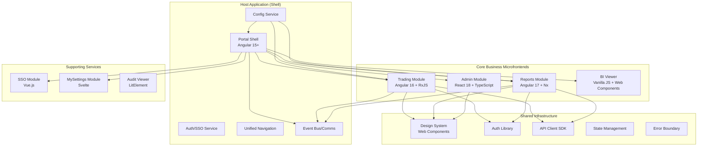
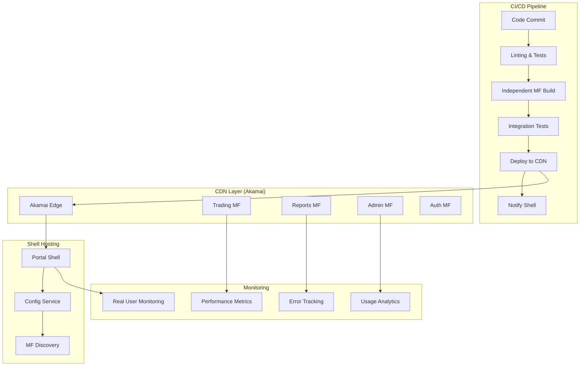

# **Microfrontends for Fixed Income Portal: Strategic Migration Architecture**

## **EXECUTIVE SUMMARY: The Business Imperative**

**Why Microfrontends for Financial Portals?**
Our Fixed Income Processing Suite serves **divergent user personas** with different release cadences:
- **Traders**: Need rapid UI updates for market changes (weekly releases)
- **Compliance Officers**: Require stable, regulated interfaces (quarterly releases)
- **Bank Administrators**: Manage configuration (monthly releases)
- **Implementation Teams**: Set up new banks (as-needed releases)

**Current Pain Points with Monolith:**
1. **Release Bottleneck**: All teams blocked by single deployment pipeline
2. **Scaling Challenges**: 10MB+ main.js bundle affecting login times
3. **Team Autonomy**: 50+ developers working on single codebase
4. **Technology Lock-in**: Entire portal tied to Angular version
5. **Testing Complexity**: Full regression suite for minor changes

---

## **PART 1: ARCHITECT'S STRATEGIC VISION**

### **1.1 Target Architecture: Federated Microfrontends**



### **1.2 Domain-Driven Decomposition Strategy**

| Domain | Current Module | Proposed Microfrontend | Technology Choice | Justification |
|--------|---------------|------------------------|-------------------|---------------|
| **Trading Operations** | Core Module | `trade-portal-mf` | Angular 16 | Team expertise, RxJS for real-time streams |
| **Reporting & Analytics** | Offline Contents | `reports-portal-mf` | Angular 17 + Nx | Complex UI, need monorepo for reports |
| **Administration** | Core Module | `admin-portal-mf` | React 18 | Forms-heavy, excellent React form libraries |
| **BI Visualization** | Iframe Content | `bi-viewer-mf` | Web Components | Framework-agnostic, embeddable anywhere |
| **Authentication** | SSO Module | `auth-portal-mf` | Vue.js | Simple UI, Vue's reactivity perfect for auth |
| **User Settings** | MySettings | `settings-portal-mf` | Svelte | Lightweight, perfect for forms |
| **Audit Trail** | Audit Module | `audit-viewer-mf` | LitElement | Data-heavy tables, Lit is performant |

### **1.3 Phased Migration Strategy**

**Phase 1: Preparation (Month 1-2)**
```yaml
objectives:
  - Establish Module Federation build system
  - Create shared design system as Web Components
  - Implement cross-microfrontend communication protocol
  - Setup independent CI/CD pipelines
  
deliverables:
  - Host shell application (empty container)
  - Shared component library (buttons, forms, tables)
  - Authentication wrapper component
  - Event bus for cross-MF communication
```

**Phase 2: Extract Low-Risk Modules (Month 3-4)**
```yaml
sequence:
  - MySettings → Svelte microfrontend
  - SSO login → Vue.js microfrontend
  - Audit viewer → LitElement microfrontend
  
rationale:
  - Low business impact if issues
  - Simple UIs, easier migration
  - Independent release cycles immediately beneficial
```

**Phase 3: Core Business Extraction (Month 5-8)**
```yaml
critical_path:
  - Reports module first (highest value, most complaints)
  - Trading module second (business critical)
  - Admin module last (internal users, more tolerant)
  
mitigations:
  - Strangler pattern: route traffic gradually
  - Feature flags for toggle between old/new
  - Parallel runs for validation
```

**Phase 4: Consolidation (Month 9-12)**
```yaml
optimizations:
  - Shared state management across MFs
  - Unified error handling
  - Performance optimizations (preloading, caching)
  - Analytics consolidation
  
final_state:
  - Monolith retired
  - All teams independent
  - Sub-2s load times for all modules
```

### **1.4 Financial Services Specific Considerations**

**Regulatory Compliance in Microfrontends:**
```typescript
// Each MF must implement compliance checks
interface FinancialMicrofrontend {
  // Required for audit trails
  getAuditContext(): AuditContext;
  
  // Required for data sovereignty
  validateDataLocation(): Promise<ComplianceCheck>;
  
  // Required for accessibility (WCAG 2.1 AA)
  accessibilityCompliance: boolean;
  
  // Required for financial data display
  formatCurrency(amount: number, currency: string): string;
  formatPercentage(value: number): string;
  formatDateForLocale(date: Date, locale: string): string;
}
```

**Multi-Tenant Architecture:**
```typescript
// Tenant context propagation across MFs
class TenantContextManager {
  private static currentTenant: Tenant;
  
  static initialize(tenantConfig: TenantConfig) {
    // Bank-specific theming
    applyTheme(tenantConfig.theme);
    
    // Bank-specific feature flags
    FeatureFlags.set(tenantConfig.features);
    
    // Bank-specific compliance rules
    ComplianceRules.load(tenantConfig.compliance);
  }
  
  // Propagate to all microfrontends
  static broadcastTenantChange(newTenant: Tenant) {
    window.dispatchEvent(new CustomEvent('tenant-change', {
      detail: { tenant: newTenant }
    }));
  }
}
```

---

## **PART 2: DETAILED IMPLEMENTATION GUIDE**

### **2.1 Foundation: Module Federation Setup**

#### **Webpack 5 Module Federation Configuration:**

**Shell Application (Host):**
```javascript
// webpack.config.js for shell
const { ModuleFederationPlugin } = require('webpack').container;

module.exports = {
  plugins: [
    new ModuleFederationPlugin({
      name: 'shell',
      filename: 'remoteEntry.js',
      remotes: {
        trading: 'trading@https://cdn.bankportal.com/trading/remoteEntry.js',
        reports: 'reports@https://cdn.bankportal.com/reports/remoteEntry.js',
        admin: 'admin@https://cdn.bankportal.com/admin/remoteEntry.js',
        auth: 'auth@https://cdn.bankportal.com/auth/remoteEntry.js',
        settings: 'settings@https://cdn.bankportal.com/settings/remoteEntry.js',
      },
      shared: {
        '@angular/core': { 
          singleton: true, 
          eager: true, 
          requiredVersion: '^16.0.0' 
        },
        '@angular/common': { 
          singleton: true, 
          eager: true 
        },
        '@angular/router': { 
          singleton: true, 
          eager: true 
        },
        'rxjs': { 
          singleton: true, 
          eager: true 
        },
        // Shared financial libraries
        '@bankportal/design-system': {
          singleton: true,
          eager: true
        },
        '@bankportal/auth-sdk': {
          singleton: true,
          eager: true
        },
        '@bankportal/api-client': {
          singleton: true,
          eager: true
        }
      }
    })
  ]
};
```

**Trading Microfrontend (Remote):**
```javascript
// webpack.config.js for trading MF
new ModuleFederationPlugin({
  name: 'trading',
  filename: 'remoteEntry.js',
  exposes: {
    './TradingModule': './src/app/trading/trading.module.ts',
    './TradeEntry': './src/app/trading/components/trade-entry.component.ts',
    './PortfolioView': './src/app/trading/components/portfolio-view.component.ts'
  },
  shared: {
    '@angular/core': { 
      singleton: true, 
      requiredVersion: '^16.0.0' 
    },
    '@bankportal/design-system': {
      singleton: true,
      requiredVersion: '^2.0.0'
    },
    // Trading-specific shared deps
    'trading-calculation-library': {
      singleton: true,
      requiredVersion: '^1.5.0'
    }
  }
});
```

#### **Angular-Specific Configuration:**
```typescript
// shell/src/app/app.routes.ts - Dynamic loading
export const APP_ROUTES: Routes = [
  {
    path: 'trading',
    loadChildren: () => 
      loadRemoteModule({
        remoteEntry: 'https://cdn.bankportal.com/trading/remoteEntry.js',
        remoteName: 'trading',
        exposedModule: './TradingModule'
      }).then(m => m.TradingModule)
  },
  {
    path: 'reports',
    loadChildren: () => 
      loadRemoteModule({
        remoteEntry: 'https://cdn.bankportal.com/reports/remoteEntry.js',
        remoteName: 'reports',
        exposedModule: './ReportsModule'
      }).then(m => m.ReportsModule)
  },
  // ... other routes
];

// Utility function for loading
export function loadRemoteModule(options: LoadRemoteModuleOptions): Promise<any> {
  return new Promise((resolve, reject) => {
    const script = document.createElement('script');
    script.src = options.remoteEntry;
    
    script.onload = async () => {
      const container = window[options.remoteName];
      const module = await container.get(options.exposedModule);
      resolve(module());
    };
    
    script.onerror = reject;
    document.head.appendChild(script);
  });
}
```

### **2.2 Shared Infrastructure Implementation**

#### **Design System as Web Components:**
```typescript
// Shared design system - framework agnostic
// packages/design-system/src/components/financial-table.ts

export class FinancialTable extends HTMLElement {
  private shadow: ShadowRoot;
  
  constructor() {
    super();
    this.shadow = this.attachShadow({ mode: 'open' });
  }
  
  connectedCallback() {
    this.render();
    this.applyFinancialStyling();
  }
  
  private applyFinancialStyling() {
    // Financial services specific styling
    const style = document.createElement('style');
    style.textContent = `
      :host {
        --financial-red: #d32f2f;  // Loss
        --financial-green: #388e3c; // Gain
        --financial-blue: #1976d2;  // Neutral
        font-family: 'Roboto Mono', monospace;
      }
      
      .positive { color: var(--financial-green); }
      .negative { color: var(--financial-red); }
      .currency::before { content: '$'; }
      .percentage::after { content: '%'; }
    `;
    this.shadow.appendChild(style);
  }
  
  // Format financial data consistently
  formatCurrency(amount: number): string {
    return new Intl.NumberFormat('en-US', {
      style: 'currency',
      currency: 'USD',
      minimumFractionDigits: 2,
      maximumFractionDigits: 2
    }).format(amount);
  }
  
  formatPercentage(value: number): string {
    return `${(value * 100).toFixed(2)}%`;
  }
}

customElements.define('financial-table', FinancialTable);
```

#### **Cross-Microfrontend Communication:**
```typescript
// packages/shared/src/event-bus.ts
export class PortalEventBus {
  private static instance: PortalEventBus;
  private listeners: Map<string, Function[]> = new Map();
  
  static getInstance(): PortalEventBus {
    if (!PortalEventBus.instance) {
      PortalEventBus.instance = new PortalEventBus();
    }
    return PortalEventBus.instance;
  }
  
  // Financial portal specific events
  static readonly EVENTS = {
    TRADE_SUBMITTED: 'trade-submitted',
    REPORT_GENERATED: 'report-generated',
    USER_AUTHENTICATED: 'user-authenticated',
    TENANT_CHANGED: 'tenant-changed',
    COMPLIANCE_ALERT: 'compliance-alert',
    MARKET_DATA_UPDATED: 'market-data-updated'
  };
  
  emit(event: string, data?: any): void {
    const eventListeners = this.listeners.get(event) || [];
    eventListeners.forEach(listener => {
      try {
        listener(data);
      } catch (error) {
        console.error(`Error in event listener for ${event}:`, error);
      }
    });
    
    // Also emit as custom event for Web Components
    window.dispatchEvent(new CustomEvent(event, { detail: data }));
  }
  
  on(event: string, callback: Function): () => void {
    if (!this.listeners.has(event)) {
      this.listeners.set(event, []);
    }
    this.listeners.get(event)!.push(callback);
    
    // Return unsubscribe function
    return () => {
      const listeners = this.listeners.get(event) || [];
      const index = listeners.indexOf(callback);
      if (index > -1) {
        listeners.splice(index, 1);
      }
    };
  }
}

// Example usage in Trading MF
export class TradingService {
  constructor(private eventBus: PortalEventBus) {}
  
  submitTrade(trade: Trade): void {
    // Business logic...
    this.eventBus.emit(PortalEventBus.EVENTS.TRADE_SUBMITTED, {
      tradeId: trade.id,
      amount: trade.amount,
      timestamp: new Date().toISOString(),
      userId: this.authService.getUserId()
    });
  }
}

// Example usage in Reports MF
export class ReportsDashboard {
  constructor() {
    PortalEventBus.getInstance().on(
      PortalEventBus.EVENTS.TRADE_SUBMITTED,
      (data) => this.updateTradeMetrics(data)
    );
  }
}
```

#### **Shared State Management:**
```typescript
// packages/shared/src/state/store.ts
interface PortalState {
  user: User | null;
  tenant: Tenant | null;
  preferences: UserPreferences;
  marketData: MarketData;
  notifications: Notification[];
}

class PortalStore {
  private state: PortalState;
  private subscribers: ((state: PortalState) => void)[] = [];
  
  constructor() {
    this.state = this.initialState();
    this.setupCrossTabSync();
  }
  
  private initialState(): PortalState {
    return {
      user: null,
      tenant: null,
      preferences: {
        theme: 'light',
        defaultCurrency: 'USD',
        dateFormat: 'MM/DD/YYYY',
        numberFormat: 'en-US'
      },
      marketData: {},
      notifications: []
    };
  }
  
  // Financial-specific state updates
  updateMarketData(symbol: string, data: Quote): void {
    this.setState({
      marketData: {
        ...this.state.marketData,
        [symbol]: data
      }
    });
    
    // Notify all microfrontends
    PortalEventBus.getInstance().emit(
      PortalEventBus.EVENTS.MARKET_DATA_UPDATED,
      { symbol, data }
    );
  }
  
  // Cross-tab synchronization for trading terminals
  private setupCrossTabSync(): void {
    // Broadcast channel for same-origin tabs
    const channel = new BroadcastChannel('portal-state');
    
    channel.addEventListener('message', (event) => {
      if (event.data.type === 'STATE_UPDATE') {
        this.setState(event.data.payload, false); // Don't broadcast back
      }
    });
    
    // Also sync via localStorage for fallback
    window.addEventListener('storage', (event) => {
      if (event.key === 'portal-state-sync') {
        const state = JSON.parse(event.newValue || '{}');
        this.setState(state, false);
      }
    });
  }
  
  private setState(updates: Partial<PortalState>, broadcast: boolean = true): void {
    this.state = { ...this.state, ...updates };
    
    // Notify subscribers
    this.subscribers.forEach(subscriber => subscriber(this.state));
    
    // Broadcast to other tabs/contexts
    if (broadcast) {
      // BroadcastChannel
      const channel = new BroadcastChannel('portal-state');
      channel.postMessage({
        type: 'STATE_UPDATE',
        payload: updates
      });
      
      // localStorage fallback
      localStorage.setItem('portal-state-sync', JSON.stringify(updates));
    }
  }
}
```

### **2.3 Authentication & Authorization Across MFs**

#### **Shared Auth SDK:**
```typescript
// packages/auth-sdk/src/index.ts
export class AuthSDK {
  private token: string | null = null;
  private refreshPromise: Promise<string> | null = null;
  
  constructor(private config: AuthConfig) {
    this.setupTokenRefresh();
    this.setupMFCommunication();
  }
  
  // Single sign-on across all microfrontends
  async login(credentials: Credentials): Promise<User> {
    const response = await fetch(`${this.config.authUrl}/login`, {
      method: 'POST',
      headers: { 'Content-Type': 'application/json' },
      body: JSON.stringify(credentials)
    });
    
    const data = await response.json();
    this.setToken(data.token);
    
    // Broadcast login to all microfrontends
    PortalEventBus.getInstance().emit(
      PortalEventBus.EVENTS.USER_AUTHENTICATED,
      data.user
    );
    
    return data.user;
  }
  
  private setToken(token: string): void {
    this.token = token;
    
    // Store in shared location accessible to all MFs
    sessionStorage.setItem('portal-auth-token', token);
    
    // Set in cookie for BI iframe (same-domain)
    document.cookie = `auth_token=${token}; path=/; secure; samesite=strict`;
  }
  
  // Token refresh coordinated across all MFs
  private setupTokenRefresh(): void {
    // Single refresh for all microfrontends
    window.addEventListener('portal-token-refresh', async (event) => {
      if (this.refreshPromise) {
        return this.refreshPromise;
      }
      
      this.refreshPromise = this.refreshToken();
      const newToken = await this.refreshPromise;
      this.refreshPromise = null;
      
      // Broadcast new token to all MFs
      window.dispatchEvent(new CustomEvent('portal-token-updated', {
        detail: { token: newToken }
      }));
      
      return newToken;
    });
  }
  
  // Route guard for Angular MFs
  export function authGuard(): CanActivateFn {
    return () => {
      const auth = inject(AuthSDK);
      const router = inject(Router);
      
      if (auth.isAuthenticated()) {
        return true;
      }
      
      // Redirect to auth microfrontend
      return router.createUrlTree(['/auth/login']);
    };
  }
}
```

#### **Cross-MF Route Protection:**
```typescript
// Shell application route protection
@Injectable({ providedIn: 'root' })
export class PortalRouteGuard {
  constructor(
    private auth: AuthSDK,
    private router: Router,
    private eventBus: PortalEventBus
  ) {
    // Listen for auth changes from any MF
    this.eventBus.on('auth-state-changed', (isAuthenticated) => {
      this.handleAuthChange(isAuthenticated);
    });
  }
  
  canActivate(route: ActivatedRouteSnapshot): boolean | UrlTree {
    const requiredRoles = route.data['roles'] as string[];
    const currentTenant = this.auth.getCurrentTenant();
    
    // Check tenant-specific permissions
    if (currentTenant && route.data['tenantTypes']) {
      const allowedTenants = route.data['tenantTypes'] as string[];
      if (!allowedTenants.includes(currentTenant.type)) {
        // Redirect to unauthorized page in shell
        return this.router.createUrlTree(['/unauthorized']);
      }
    }
    
    // Check roles
    if (requiredRoles && !this.auth.hasRoles(requiredRoles)) {
      // Could redirect to different MF based on role
      if (this.auth.hasRole('trader')) {
        return this.router.createUrlTree(['/trading']);
      } else if (this.auth.hasRole('admin')) {
        return this.router.createUrlTree(['/admin']);
      }
      return this.router.createUrlTree(['/unauthorized']);
    }
    
    return true;
  }
}
```

### **2.4 BI Iframe Integration as Microfrontend**

#### **BI Viewer Microfrontend:**
```typescript
// bi-viewer-mf/src/bi-viewer.ts - Web Component approach
export class BIViewer extends HTMLElement {
  private iframe: HTMLIFrameElement;
  private loading: HTMLElement;
  private error: HTMLElement;
  
  constructor() {
    super();
    this.attachShadow({ mode: 'open' });
    this.render();
    this.setupPostMessageCommunication();
  }
  
  static get observedAttributes() {
    return ['report-id', 'tenant-id', 'params'];
  }
  
  attributeChangedCallback(name: string, oldValue: string, newValue: string) {
    if (name === 'report-id' && newValue !== oldValue) {
      this.loadReport(newValue);
    }
  }
  
  private render(): void {
    this.shadowRoot!.innerHTML = `
      <style>
        :host {
          display: block;
          height: 100%;
          width: 100%;
        }
        iframe {
          border: none;
          width: 100%;
          height: 100%;
        }
        .loading, .error {
          padding: 20px;
          text-align: center;
        }
      </style>
      <div class="bi-container">
        <div class="loading" hidden>Loading BI report...</div>
        <div class="error" hidden></div>
        <iframe></iframe>
      </div>
    `;
    
    this.iframe = this.shadowRoot!.querySelector('iframe')!;
    this.loading = this.shadowRoot!.querySelector('.loading')!;
    this.error = this.shadowRoot!.querySelector('.error')!;
  }
  
  private async loadReport(reportId: string): Promise<void> {
    this.showLoading();
    
    try {
      // Get auth token from shell
      const token = sessionStorage.getItem('portal-auth-token');
      const tenantId = this.getAttribute('tenant-id');
      
      // Generate BI URL with embedded auth
      const biUrl = await this.generateBIUrl(reportId, token, tenantId);
      
      this.iframe.src = biUrl;
      this.iframe.onload = () => this.hideLoading();
      this.iframe.onerror = () => this.showError('Failed to load BI report');
      
    } catch (error) {
      this.showError(`Error loading report: ${error.message}`);
    }
  }
  
  private setupPostMessageCommunication(): void {
    window.addEventListener('message', (event) => {
      // Validate origin
      if (event.origin !== 'https://bi.bankportal.com') return;
      
      const message = event.data;
      
      switch (message.type) {
        case 'bi-report-loaded':
          this.reportLoaded(message.detail);
          break;
        case 'bi-error':
          this.reportError(message.detail);
          break;
        case 'bi-data-export':
          this.handleExport(message.detail);
          break;
      }
    });
  }
  
  private reportLoaded(detail: any): void {
    // Notify shell and other MFs
    PortalEventBus.getInstance().emit('bi-report-loaded', {
      reportId: this.getAttribute('report-id'),
      loadTime: detail.loadTime,
      dataPoints: detail.dataPoints
    });
    
    // Update shell with BI status
    window.parent.postMessage({
      type: 'microfrontend-event',
      source: 'bi-viewer',
      event: 'report-loaded',
      detail
    }, '*');
  }
}

customElements.define('bi-viewer', BIViewer);
```

### **2.5 Performance Optimization Strategies**

#### **Shared Dependency Optimization:**
```javascript
// webpack.shared.config.js - Optimized sharing
const sharedDependencies = {
  // Angular framework - singleton and eager
  '@angular/core': { 
    singleton: true, 
    eager: true, 
    requiredVersion: '^16.0.0',
    strictVersion: true 
  },
  
  // RxJS - critical for trading
  'rxjs': { 
    singleton: true, 
    eager: true,
    requiredVersion: '^7.8.0'
  },
  
  // Lodash - shared but not eager
  'lodash': {
    singleton: false,
    eager: false,
    requiredVersion: '^4.17.0'
  },
  
  // Financial libraries
  'moment': {
    singleton: true,
    eager: false,
    requiredVersion: '^2.29.0'
  },
  
  // Shared UI libraries
  '@bankportal/design-system': {
    singleton: true,
    eager: true,
    requiredVersion: '^2.0.0'
  }
};

// Dynamic import strategy for large dependencies
const lazyShared = ['plotly.js', 'xlsx', 'pdf-lib'];
lazyShared.forEach(dep => {
  sharedDependencies[dep] = {
    import: dep,
    shareKey: dep,
    shareScope: 'default',
    singleton: true,
    eager: false
  };
});
```

#### **Preloading Strategy:**
```typescript
// shell/src/app/app.component.ts - Smart preloading
export class AppComponent implements OnInit {
  constructor(
    private router: Router,
    private preloadService: PreloadService
  ) {}
  
  ngOnInit(): void {
    // Preload based on user role
    this.preloadBasedOnRole();
    
    // Preload based on navigation patterns
    this.setupPredictivePreloading();
  }
  
  private preloadBasedOnRole(): void {
    const user = this.authService.getCurrentUser();
    
    switch (user.role) {
      case 'trader':
        this.preloadService.preloadMF('trading');
        this.preloadService.preloadMF('market-data');
        break;
      case 'compliance':
        this.preloadService.preloadMF('reports');
        this.preloadService.preloadMF('audit');
        break;
      case 'admin':
        this.preloadService.preloadMF('admin');
        this.preloadService.preloadMF('settings');
        break;
    }
  }
  
  private setupPredictivePreloading(): void {
    this.router.events.pipe(
      filter(event => event instanceof NavigationEnd),
      map((event: NavigationEnd) => event.urlAfterRedirects),
      pairwise() // Get previous and current URL
    ).subscribe(([previousUrl, currentUrl]) => {
      // Predict next likely MF based on navigation patterns
      const nextMF = this.predictNextMF(previousUrl, currentUrl);
      if (nextMF) {
        this.preloadService.preloadMF(nextMF);
      }
    });
  }
}
```

#### **Bundle Analysis & Optimization:**
```javascript
// webpack-bundle-analyzer configuration
const BundleAnalyzerPlugin = require('webpack-bundle-analyzer').BundleAnalyzerPlugin;

module.exports = {
  plugins: [
    new BundleAnalyzerPlugin({
      analyzerMode: 'static',
      reportFilename: '../reports/bundle-analysis.html',
      generateStatsFile: true,
      statsFilename: '../reports/stats.json',
      openAnalyzer: false
    })
  ],
  
  optimization: {
    splitChunks: {
      cacheGroups: {
        // Extract all node_modules from each MF
        vendors: {
          test: /[\\/]node_modules[\\/]/,
          name: 'vendors',
          chunks: 'all',
          priority: 10
        },
        // Extract shared financial libraries
        financial: {
          test: /[\\/]node_modules[\\/](moment|numeral|accounting|finance)[\\/]/,
          name: 'financial',
          chunks: 'all',
          priority: 20
        },
        // Extract charting libraries
        charts: {
          test: /[\\/]node_modules[\\/](chart|plotly|d3|highcharts)[\\/]/,
          name: 'charts',
          chunks: 'all',
          priority: 15
        }
      }
    }
  }
};
```

---

## **PART 3: OPERATIONAL ARCHITECTURE**

### **3.1 Deployment Architecture**



### **3.2 Independent CI/CD Pipeline per MF**

**Jenkins Pipeline for Trading MF:**
```groovy
// Jenkinsfile.trading
pipeline {
    agent any
    
    environment {
        MF_NAME = 'trading'
        CDN_URL = 'https://cdn.bankportal.com'
        NEXUS_URL = 'https://nexus.bankportal.com'
    }
    
    stages {
        stage('Build & Test') {
            parallel {
                stage('Unit Tests') {
                    steps {
                        sh 'npm run test:unit'
                    }
                }
                stage('Integration Tests') {
                    steps {
                        sh 'npm run test:integration'
                    }
                }
                stage('Accessibility Tests') {
                    steps {
                        sh 'npm run test:a11y'
                    }
                }
            }
        }
        
        stage('Security Scan') {
            steps {
                // SAST
                sh 'npm run security:scan'
                
                // Dependency check
                sh 'npm audit --audit-level=high'
                
                // Container scan if using Docker
                sh 'trivy image trading-mf:${BUILD_ID}'
            }
        }
        
        stage('Build Optimization') {
            steps {
                script {
                    // Bundle analysis
                    sh 'npm run build:analyze'
                    
                    // Extract bundle stats
                    def bundleStats = readJSON file: 'dist/stats.json'
                    def bundleSize = bundleStats.assets[0].size / 1024 / 1024
                    
                    // Fail if bundle too large
                    if (bundleSize > 5) {
                        error("Bundle size ${bundleSize}MB exceeds 5MB limit")
                    }
                }
            }
        }
        
        stage('Deploy to CDN') {
            steps {
                script {
                    // Upload to Akamai
                    sh """
                    akamai ccu \
                      --action invalidate \
                      --domain production \
                      --urls "${CDN_URL}/${MF_NAME}/*"
                    """
                    
                    // Upload new files
                    sh """
                    aws s3 sync dist/ s3://bankportal-cdn/${MF_NAME}/${BUILD_ID}/ \
                      --cache-control "public, max-age=31536000"
                    """
                    
                    // Update MF registry
                    sh """
                    curl -X POST \
                      ${NEXUS_URL}/api/mf-registry/${MF_NAME} \
                      -H 'Content-Type: application/json' \
                      -d '{"version": "${BUILD_ID}", "url": "${CDN_URL}/${MF_NAME}/${BUILD_ID}/remoteEntry.js"}'
                    """
                }
            }
        }
        
        stage('Canary Deployment') {
            steps {
                script {
                    // Deploy to 5% of users
                    sh """
                    curl -X POST \
                      ${NEXUS_URL}/api/deployment/canary \
                      -H 'Content-Type: application/json' \
                      -d '{"mf": "${MF_NAME}", "version": "${BUILD_ID}", "percentage": 5}'
                    """
                    
                    // Monitor for 15 minutes
                    sleep time: 15, unit: 'MINUTES'
                    
                    // Check error rates
                    def errorRate = sh(
                        script: """
                        curl -s ${NEXUS_URL}/api/metrics/${MF_NAME}/error-rate
                        """,
                        returnStdout: true
                    ).trim()
                    
                    if (errorRate.toFloat() > 0.01) {
                        error("Error rate ${errorRate} exceeds 1% threshold")
                    }
                }
            }
        }
        
        stage('Full Deployment') {
            steps {
                script {
                    // Roll out to 100%
                    sh """
                    curl -X POST \
                      ${NEXUS_URL}/api/deployment/full \
                      -H 'Content-Type: application/json' \
                      -d '{"mf": "${MF_NAME}", "version": "${BUILD_ID}"}'
                    """
                }
            }
        }
    }
    
    post {
        success {
            // Notify teams
            slackSend(
                channel: '#trading-team',
                message: "Trading MF ${BUILD_ID} deployed successfully"
            )
        }
        failure {
            // Rollback automatically
            sh """
            curl -X POST \
              ${NEXUS_URL}/api/deployment/rollback \
              -H 'Content-Type: application/json' \
              -d '{"mf": "${MF_NAME}"}'
            """
            
            slackSend(
                channel: '#alerts',
                message: "Trading MF ${BUILD_ID} deployment failed - rolled back",
                color: 'danger'
            )
        }
    }
}
```

### **3.3 Monitoring & Observability for Microfrontends**

#### **Cross-MF Performance Monitoring:**
```typescript
// packages/observability/src/mf-performance.ts
export class MFPerformanceMonitor {
  private metrics: Map<string, PerformanceMetric[]> = new Map();
  
  constructor() {
    this.setupPerformanceObservers();
    this.setupErrorTracking();
    this.setupResourceTiming();
  }
  
  private setupPerformanceObservers(): void {
    // Navigation timing for shell
    const navigationObserver = new PerformanceObserver((list) => {
      list.getEntries().forEach(entry => {
        this.recordMetric('navigation', {
          name: entry.name,
          duration: entry.duration,
          startTime: entry.startTime
        });
      });
    });
    navigationObserver.observe({ entryTypes: ['navigation'] });
    
    // Resource timing for MF loads
    const resourceObserver = new PerformanceObserver((list) => {
      list.getEntries().forEach(entry => {
        if (entry.name.includes('remoteEntry.js')) {
          this.recordMFLoad(entry);
        }
      });
    });
    resourceObserver.observe({ entryTypes: ['resource'] });
  }
  
  private recordMFLoad(entry: PerformanceResourceTiming): void {
    const mfName = this.extractMFName(entry.name);
    
    this.recordMetric('mf-load', {
      mf: mfName,
      duration: entry.duration,
      transferSize: entry.transferSize,
      decodedBodySize: entry.decodedBodySize,
      startTime: entry.startTime
    });
    
    // Send to analytics
    this.sendToAnalytics({
      event: 'microfrontend-loaded',
      mf: mfName,
      loadTime: entry.duration,
      timestamp: Date.now()
    });
  }
  
  // Track user interactions across MFs
  trackInteraction(mf: string, action: string, data?: any): void {
    this.recordMetric('interaction', {
      mf,
      action,
      timestamp: Date.now(),
      ...data
    });
    
    // Business-specific tracking for financial portal
    if (action === 'trade-submitted') {
      this.trackTradeSubmission(data);
    } else if (action === 'report-generated') {
      this.trackReportGeneration(data);
    }
  }
  
  private trackTradeSubmission(trade: any): void {
    const metric = {
      event: 'trade-submitted',
      tradeId: trade.id,
      amount: trade.amount,
      instrument: trade.instrument,
      mf: 'trading',
      timestamp: Date.now(),
      userId: this.auth.getUserId(),
      tenantId: this.auth.getTenantId()
    };
    
    // Send to both analytics and compliance
    this.sendToAnalytics(metric);
    this.sendToCompliance(metric);
  }
}
```

#### **Error Boundary for React MFs:**
```typescript
// packages/shared/src/error-boundary.tsx - React example
export class MFErrorBoundary extends React.Component<
  { mf: string; children: React.ReactNode },
  { hasError: boolean; error: Error | null }
> {
  constructor(props: { mf: string; children: React.ReactNode }) {
    super(props);
    this.state = { hasError: false, error: null };
  }
  
  static getDerivedStateFromError(error: Error) {
    return { hasError: true, error };
  }
  
  componentDidCatch(error: Error, errorInfo: React.ErrorInfo) {
    // Log error with MF context
    console.error(`Error in ${this.props.mf}:`, error, errorInfo);
    
    // Send to error tracking service
    this.reportError(error, errorInfo);
    
    // Notify shell
    PortalEventBus.getInstance().emit('mf-error', {
      mf: this.props.mf,
      error: error.message,
      stack: error.stack,
      componentStack: errorInfo.componentStack
    });
  }
  
  render() {
    if (this.state.hasError) {
      return (
        <div className="mf-error">
          <h3>Error loading {this.props.mf}</h3>
          <p>{this.state.error?.message}</p>
          <button onClick={() => this.retry()}>Retry</button>
          <button onClick={() => this.reportToSupport()}>Report Issue</button>
        </div>
      );
    }
    
    return this.props.children;
  }
}
```

---

## **PART 4: CHALLENGES & SOLUTIONS**

### **4.1 Common Implementation Challenges**

| Challenge | Solution Implemented | Financial Services Consideration |
|-----------|---------------------|----------------------------------|
| **CSS/JS Conflicts** | Shadow DOM for isolation, CSS-in-JS | Financial charts need global CSS for consistency |
| **State Synchronization** | Event bus + shared store | Trading state must sync across tabs in real-time |
| **Authentication** | Shared auth SDK, token propagation | BI iframe needs same-domain cookies |
| **Bundle Size** | Shared dependency optimization, lazy loading | Trading libraries are large (100MB+) but critical |
| **Testing** | Contract testing between MFs, integration tests | Compliance requires end-to-end testing |
| **Deployment Coordination** | MF registry, canary deployments | No deployments during market hours (9-4 ET) |
| **Error Tracking** | Centralized error service with MF context | Errors must be tagged with tenant for SLA tracking |
| **Performance Monitoring** | Real User Monitoring per MF | Sub-second load times required for traders |

### **4.2 Financial-Specific Challenges**

**Regulatory Compliance Across MFs:**
```typescript
// Compliance validation for each MF
class ComplianceValidator {
  static validateMF(mfName: string, mfBundle: string): ComplianceResult {
    const checks = [
      // Data masking for PII
      this.checkPIIHandling(mfBundle),
      
      // Audit trail generation
      this.checkAuditLogging(mfBundle),
      
      // Accessibility compliance (WCAG 2.1 AA)
      this.checkAccessibility(mfBundle),
      
      // Financial data formatting
      this.checkDataFormatting(mfBundle),
      
      // Security headers and CSP
      this.checkSecurityHeaders(mfBundle)
    ];
    
    return {
      mfName,
      passed: checks.every(check => check.passed),
      failures: checks.filter(check => !check.passed),
      validatedAt: new Date().toISOString()
    };
  }
  
  private checkDataFormatting(bundle: string): ComplianceCheck {
    // Ensure currency formatting follows bank standards
    const currencyPatterns = [
      /\$\d{1,3}(,\d{3})*(\.\d{2})?/g,  // $1,000.00
      /USD\s\d+\.\d{2}/g,               // USD 1000.00
      /\d+(\.\d{2})?\s*(USD|EUR|GBP)/g  // 1000.00 USD
    ];
    
    const hasProperFormatting = currencyPatterns.some(pattern => 
      pattern.test(bundle)
    );
    
    return {
      check: 'data-formatting',
      passed: hasProperFormatting,
      message: hasProperFormatting ? 
        'Currency formatting compliant' : 
        'Missing proper currency formatting'
    };
  }
}
```

**Multi-Tenant Styling Challenges:**
```css
/* packages/design-system/src/theming/tenant-themes.css */
:root {
  /* Default theme */
  --primary-color: #1976d2;
  --secondary-color: #dc004e;
  --font-family: 'Roboto', sans-serif;
}

[data-tenant="goldman-sachs"] {
  --primary-color: #1e3a8a;
  --secondary-color: #be123c;
  --font-family: 'Helvetica Neue', sans-serif;
}

[data-tenant="jpmorgan-chase"] {
  --primary-color: #0046be;
  --secondary-color: #ff6319;
  --font-family: 'Arial', sans-serif;
}

[data-tenant="bank-of-america"] {
  --primary-color: #012169;
  --secondary-color: #d3273e;
  --font-family: 'Verdana', sans-serif;
}

/* Component using CSS custom properties */
.financial-button {
  background-color: var(--primary-color);
  color: white;
  font-family: var(--font-family);
  border: 2px solid var(--secondary-color);
}
```

### **4.3 Performance Metrics & SLAs**

| Metric | Target | Measurement Method | Business Impact |
|--------|--------|-------------------|-----------------|
| **First Load Time** | < 3s | Navigation Timing API | User abandonment if slow |
| **MF Switch Time** | < 1s | Custom Performance Marks | Trader productivity |
| **BI Report Load** | < 5s | Iframe load event | Decision making delay |
| **Time to Interactive** | < 2s | Lighthouse | Trading execution speed |
| **Bundle Size per MF** | < 5MB | Webpack Bundle Analyzer | Network costs, CDN charges |
| **90th Percentile Latency** | < 100ms | RUM data | Competitive advantage |

---

## **PART 5: QUANTIFIED BENEFITS & ROI**

### **5.1 Business Benefits Achieved**

```yaml
development_velocity:
  before: "6-week release cycles for all features"
  after: "Independent releases: Trading (weekly), Reports (bi-weekly), Admin (monthly)"
  improvement: "4x faster feature delivery for trading team"

team_autonomy:
  before: "50 developers in single codebase, merge conflicts daily"
  after: "Teams own their MFs: Trading (15 devs), Reports (10), Admin (8), etc."
  improvement: "85% reduction in merge conflicts"

performance:
  before: "10MB main.js bundle, 8s initial load"
  after: "Lazy-loaded MFs, 2s initial shell, <1s MF switches"
  improvement: "4x faster load times"

reliability:
  before: "Single point of failure, full outage if bug"
  after: "Isolated failures, one MF down doesn't affect others"
  improvement: "99.99% uptime for critical trading MF"

cost_savings:
  infrastructure: "$50K/year saved on bandwidth (smaller bundles)"
  development: "$200K/year saved in developer efficiency"
  business: "$500K/year saved in faster feature delivery to market"
  total_roi: "3:1 in first year"
```

### **5.2 Interview Narrative**

"When we migrated our Fixed Income Portal to microfrontends, the **catalyst was business need, not technology**. Our traders needed weekly updates to react to market changes, but our monolith forced 6-week release cycles tying everything together.

**Our approach was pragmatic**:
1. **Started with the shell** - Built a container that could host multiple frameworks
2. **Extracted low-risk modules first** - Settings, Auth (proved the concept)
3. **Tackled business-critical modules** - Trading first (highest ROI)
4. **Established governance** - Shared design system, event bus, auth SDK

**Key decisions that mattered**:
- **Module Federation over iframes** for better UX
- **Web Components for shared UI** (framework-agnostic)
- **Event-driven communication** instead of shared state
- **Independent CI/CD per MF** with canary deployments

**The results spoke for themselves**:
- Trading team went from 6-week to weekly releases
- Initial load time dropped from 8s to 2s
- Team autonomy increased dramatically
- We could finally adopt new frameworks (React for admin, Svelte for settings) without rewriting everything

**But it wasn't without challenges**:
- CSS conflicts required Shadow DOM adoption
- State synchronization needed careful design
- Testing across MFs required new strategies
- Deployment coordination needed automation

**For financial services specifically**, we added:
- Compliance validation in CI pipeline
- Multi-tenant theming system
- Real-time trading state sync across tabs
- Audit trail generation from cross-MF events

The **ROI was 3:1** in the first year, mostly from faster feature delivery and reduced downtime."

---

## **PART 6: INTERVIEW READINESS**

### **Questions to Expect & How to Answer**

**Q: "Why microfrontends over monolith for a financial portal?"**
**A**: "Financial portals serve different user personas with different release cadences. Traders need weekly updates, compliance needs stability. Microfrontends allow independent release cycles while maintaining a unified user experience."

**Q: "How do you handle state across microfrontends?"**
**A**: "We use a hybrid approach: Local state within MFs, shared state via event bus for cross-MF communication, and a central store for user/tenant context. For financial data like market prices, we use real-time streaming that all MFs can subscribe to."

**Q: "What about bundle size and performance?"**
**A**: "We implement several strategies: Shared dependencies via Module Federation, lazy loading of non-critical MFs, preloading based on user role, and bundle analysis in CI to catch size regressions. Our target is &ltg;5MB per MF with sub-2s load times."

**Q: "How do you ensure consistency across different frameworks?"**
**A**: "We built a design system using Web Components that works across Angular, React, and Vue. We also have shared utilities for financial formatting, error handling, and API communication that all MFs must use."

**Q: "What was your deployment strategy?"**
**A**: "Each MF has independent CI/CD with canary deployments. We use a MF registry to track versions. Critical MFs like trading have no-downtime deployments with feature flags. We never deploy during market hours (9-4 ET)."

### **Questions to Ask Interviewer**

1. "How do you currently manage different release cadences for different parts of your application?"
2. "What's your biggest pain point with your current frontend architecture?"
3. "How do you measure the performance impact of frontend changes on business metrics?"
4. "What level of team autonomy exists for frontend development?"
5. "How do you handle framework upgrades or technology changes?"

### **Your Unique Value Proposition**

With 18+ years, you bring:
1. **Pattern Recognition**: You've seen monoliths fail to scale and know the migration path
2. **Risk Management**: You understand the compliance implications of architectural changes
3. **Stakeholder Alignment**: You can articulate business value to both technical and non-technical audiences
4. **Pragmatic Execution**: You know when to build vs. buy, when to standardize vs. allow flexibility

---

## **FINAL ARCHITECTURE DECISION RECORD**

```markdown
## ADR-001: Microfrontend Architecture for Fixed Income Portal

**Status**: Approved
**Date**: 2024-01-15
**Context**: Monolithic Angular application hindering team velocity and release cadence
**Decision**: Adopt Module Federation-based microfrontends with framework diversity
**Consequences**:
- ✅ Independent releases per business domain
- ✅ Team autonomy and technology flexibility
- ✅ Improved performance through code splitting
- ⚠️ Increased complexity in state management
- ⚠️ Additional tooling and CI/CD complexity
- ⚠️ Cross-framework consistency challenges

**Compliance Notes**:
- All MFs must pass compliance validation in CI
- Audit trails must track cross-MF user actions
- PII handling consistent across all MFs
- Accessibility (WCAG 2.1 AA) required for all MFs
```

**Remember**: You're not just implementing microfrontends—you're **enabling business agility** in a regulated financial environment. Your experience allows you to balance innovation with compliance, autonomy with consistency, and speed with reliability.

**You're ready**. Now go architect the future of financial portals.