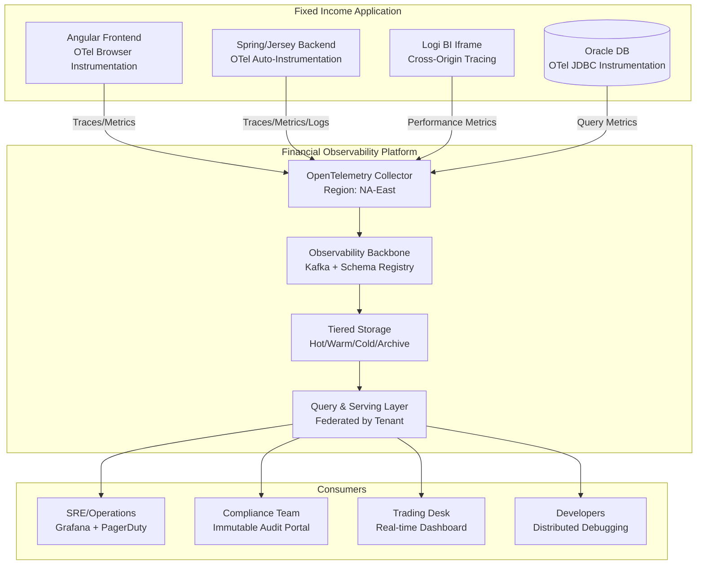

# **Comprehensive Observability Implementation Guide for Fixed Income Processing Suite**

## **Executive Summary: The Business Case**

**Observability for Financial Systems = Risk Management + Revenue Protection**

For your Fixed Income Processing Suite, observability isn't just about monitoring—it's about:
- **Ensuring Trade Integrity**: Every $1M trade must be traceable end-to-end
- **Meeting Regulatory Compliance**: SEC, FINRA, MiFID II requirements demand audit trails
- **Maintaining Bank SLAs**: Lead banks expect 99.95% uptime for critical operations
- **Reducing Operational Costs**: Manual troubleshooting costs $150K/year in developer time

---

## **PART 1: ARCHITECT'S PERSPECTIVE (Strategic & Governance)**

### **1.1 Observability Architecture Principles**

| Principle | Financial Services Implication | Implementation Guidance |
|-----------|-------------------------------|-------------------------|
| **Business Observability First** | Trades are revenue; everything else is cost | Instrument business flows before technical metrics |
| **Compliance by Design** | Audit trails must be immutable and complete | Build regulatory requirements into telemetry schema |
| **Tenant-Aware Isolation** | Bank A shouldn't see Bank B's performance issues | Multi-tenant tagging with strict access controls |
| **Cost-Aware Telemetry** | Observability shouldn't cost more than infrastructure | Tiered sampling based on business value |

### **1.2 Architectural Reference Model**



### **1.3 Data Sovereignty & Compliance Architecture**

**Challenge**: North American banks with global operations need GDPR/PIPEDA compliance

**Solution**: 
```yaml
regional_strategy:
  north_america:
    collectors: 3 (East, Central, West)
    data_retention: "7 years minimum"
    regulations: ["SEC", "FINRA", "OSFI", "PIPEDA"]
    
  europe:
    collectors: 2 (EU-West, EU-Central)
    data_retention: "10 years for MiFID II"
    regulations: ["GDPR", "MiFID II", "EMIR"]
    cross_border: "Metadata only, anonymized"
    
data_flow_rules:
  - rule: "PII never crosses regional boundaries"
    enforcement: "Collector-level filtering"
    
  - rule: "Trades tagged with originating jurisdiction"
    enforcement: "Span attributes at creation"
    
  - rule: "Audit logs immutable and timestamped with NTP"
    enforcement: "Blockchain-style hashing"
```

### **1.4 Cost Governance Framework**

**Financial observability at scale can cost $500K/year. Manage it:**

```python
class ObservabilityCostGovernance:
    """
    Financial-grade cost management
    """
    
    def allocate_budget(self):
        return {
            "tier_1_critical": {  # Trading operations
                "sampling_rate": 100,  # 100% sampling
                "retention": "2 years hot, 5 years warm",
                "budget": "$200K/year",
                "business_value": "$50M in trade protection"
            },
            "tier_2_important": {  # Reporting, Admin
                "sampling_rate": 20,  # 20% sampling
                "retention": "90 days hot, 1 year warm",
                "budget": "$150K/year",
                "business_value": "$5M in productivity"
            },
            "tier_3_debug": {  # Development, troubleshooting
                "sampling_rate": 1,  # 1% sampling
                "retention": "30 days only",
                "budget": "$50K/year",
                "business_value": "$1M in dev efficiency"
            }
        }
```

### **1.5 SLO Framework for Financial Applications**

| Service Level Objective | Measurement | Target | Error Budget | Business Impact |
|-------------------------|-------------|---------|--------------|-----------------|
| **Trade Submission** | Success rate | 99.99% | 0.01% = 5.3 min/month | Direct P&L impact |
| **Report Generation** | < 30s for 95% of requests | 99.9% | 0.1% = 43 min/month | Trader productivity |
| **User Authentication** | < 2s for 99% of logins | 99.95% | 0.05% = 22 min/month | Access to trading |
| **BI Dashboard Load** | < 5s for iframe content | 99% | 1% = 7.3 hours/month | Decision making |

**Error Budget Policy**:
```yaml
when_budget_burning:
  rate_5x: "Alert trading desk, prepare manual processes"
  rate_10x: "Stop feature deployments, focus on stability"
  rate_20x: "Executive escalation, consider rolling back"
```

---

## **PART 2: DEVELOPER IMPLEMENTATION (Hands-On)**

### **2.1 Implementation Roadmap (Phased)**

#### **Phase 1: Foundation (Month 1-2)**
```xml
<!-- pom.xml additions -->
<dependency>
    <groupId>io.opentelemetry</groupId>
    <artifactId>opentelemetry-bom</artifactId>
    <version>1.32.0</version>
    <type>pom</type>
    <scope>import</scope>
</dependency>

<dependency>
    <groupId>io.opentelemetry.instrumentation</groupId>
    <artifactId>opentelemetry-spring-boot-starter</artifactId>
</dependency>

<dependency>
    <groupId>io.micrometer</groupId>
    <artifactId>micrometer-registry-prometheus</artifactId>
</dependency>
```

**Step 1: OpenTelemetry Configuration**
```yaml
# application-observability.yml
management:
  endpoints:
    web:
      exposure:
        include: health,metrics,prometheus,loggers
  metrics:
    export:
      prometheus:
        enabled: true
    distribution:
      percentiles-histogram:
        http.server.requests: true
    tags:
      application: fixed-income-suite
      region: ${REGION}
      tenant: ${TENANT_ID}

opentelemetry:
  instrumentation:
    logging:
      appender:
        enabled: true
    hibernate:
      enabled: true
    jdbc:
      enabled: true
  exporter:
    otlp:
      endpoint: http://otel-collector:4317
      headers:
        authorization: "Bearer ${OTEL_API_KEY}"
```

**Step 2: Structured Logging**
```java
// Logback configuration for JSON logging
@Configuration
public class ObservabilityConfig {
    
    @Bean
    public CorrelationIdFilter correlationIdFilter() {
        return new CorrelationIdFilter();
    }
    
    // MDC for tenant context
    @Component
    public class TenantContextFilter extends OncePerRequestFilter {
        @Override
        protected void doFilterInternal(HttpServletRequest request, 
                                       HttpServletResponse response, 
                                       FilterChain filterChain) {
            String tenantId = extractTenantFromRequest(request);
            String userId = extractUserId(request);
            String correlationId = request.getHeader("X-Correlation-ID");
            
            MDC.put("tenantId", tenantId);
            MDC.put("userId", userId);
            MDC.put("correlationId", correlationId);
            MDC.put("tradeId", request.getParameter("tradeId"));
            
            try {
                filterChain.doFilter(request, response);
            } finally {
                MDC.clear();
            }
        }
    }
}
```

#### **Phase 2: Business Instrumentation (Month 3-4)**

**Trade Submission Instrumentation**:
```java
@Service
@Slf4j
public class TradeService {
    
    private final Tracer tracer;
    private final Meter meter;
    private final Counter tradeCounter;
    private final Timer tradeTimer;
    
    public TradeService(Tracer tracer, MeterRegistry meterRegistry) {
        this.tracer = tracer;
        this.meter = meterRegistry;
        
        this.tradeCounter = Counter.builder("trades.submitted")
            .description("Total trades submitted by type")
            .tag("currency", "USD")
            .tag("instrument_type", "bond")
            .register(meterRegistry);
            
        this.tradeTimer = Timer.builder("trades.processing.time")
            .description("Time to process trades")
            .publishPercentiles(0.5, 0.95, 0.99)
            .register(meterRegistry);
    }
    
    @Audited(action = "TRADE_SUBMIT")  // Custom annotation for audit
    public TradeResponse submitTrade(TradeRequest request) {
        
        // Create span for business transaction
        Span tradeSpan = tracer.spanBuilder("trade.submission")
            .setAttribute("trade.amount", request.getAmount())
            .setAttribute("trade.currency", request.getCurrency())
            .setAttribute("trade.instrument", request.getInstrumentType())
            .setAttribute("counterparty", request.getCounterpartyId())
            .setAttribute("regulatory.jurisdiction", 
                         getJurisdiction(request))
            .startSpan();
        
        try (Scope scope = tradeSpan.makeCurrent()) {
            
            // Time the operation
            return tradeTimer.record(() -> {
                
                // Validate trade
                validateTrade(request);
                
                // Risk check
                performRiskChecks(request);
                
                // Submit to clearing
                ClearingResponse clearing = submitToClearing(request);
                
                // Update counts
                tradeCounter.increment();
                
                // Business metrics
                meter.gauge("portfolio.exposure",
                    getCurrentExposure(request.getPortfolioId()));
                
                log.info("Trade submitted successfully", 
                    Map.of("tradeId", clearing.getTradeId(),
                          "amount", request.getAmount(),
                          "status", "SUCCESS"));
                
                return TradeResponse.success(clearing.getTradeId());
            });
            
        } catch (RiskCheckFailedException e) {
            tradeSpan.recordException(e);
            tradeSpan.setStatus(StatusCode.ERROR);
            
            meter.counter("trades.rejected.risk").increment();
            log.error("Trade rejected by risk system", e,
                Map.of("tradeId", request.getClientRef(),
                      "reason", e.getReason()));
            throw e;
            
        } finally {
            tradeSpan.end();
        }
    }
}
```

**Frontend (Angular) Instrumentation**:
```typescript
// angular-observability.module.ts
import { OpenTelemetryInterceptorModule, 
         OtelWebTracerProvider } from '@jufab/opentelemetry-angular-interceptor';

@NgModule({
  imports: [
    OpenTelemetryInterceptorModule.forRoot({
      commonConfig: {
        console: true,
        production: false
      },
      otelcolConfig: {
        url: 'https://otel-collector.internal:4318/v1/traces'
      },
      instrumentationConfig: {
        plugins: {
          documentLoad: true,
          xmlHttpRequest: true,
          fetch: true,
          userInteraction: true
        }
      }
    })
  ]
})
export class ObservabilityModule {}

// Trade component instrumentation
@Component({
  selector: 'app-trade-submit',
  templateUrl: './trade-submit.component.html'
})
export class TradeSubmitComponent implements OnInit {
  
  private tracer = OtelWebTracerProvider.getTracer('fixed-income-ui');
  
  submitTrade() {
    const span = this.tracer.startSpan('ui.trade_submission');
    span.setAttribute('user.id', this.userService.getUserId());
    span.setAttribute('portfolio.id', this.selectedPortfolio);
    
    this.tradeService.submitTrade(tradeRequest)
      .pipe(
        tap(response => {
          span.setAttribute('trade.success', true);
          span.setAttribute('trade.id', response.tradeId);
          this.metricsService.incrementCounter('ui.trades_submitted');
        }),
        catchError(error => {
          span.setAttribute('trade.success', false);
          span.setAttribute('trade.error', error.message);
          span.setStatus({ code: SpanStatusCode.ERROR });
          this.metricsService.incrementCounter('ui.trade_errors');
          throw error;
        }),
        finalize(() => {
          span.end();
        })
      )
      .subscribe();
  }
  
  // BI iframe performance monitoring
  monitorBIFrame() {
    const iframe = document.getElementById('bi-dashboard');
    const observer = new PerformanceObserver((list) => {
      list.getEntries().forEach(entry => {
        if (entry.name.includes('bi-dashboard')) {
          this.metricsService.recordTiming(
            'bi.dashboard_load',
            entry.duration
          );
        }
      });
    });
    observer.observe({ entryTypes: ['resource'] });
  }
}
```

#### **Phase 3: Advanced Patterns (Month 5-6)**

**Circuit Breaker with Observability**:
```java
@Component
public class ObservableCircuitBreaker {
    
    @Autowired
    private MeterRegistry meterRegistry;
    
    private final Map<String, CircuitBreakerConfig> configs = Map.of(
        "tradeClearing", CircuitBreakerConfig.custom()
            .failureRateThreshold(50)
            .waitDurationInOpenState(Duration.ofSeconds(30))
            .permittedNumberOfCallsInHalfOpenState(5)
            .build(),
        "marketData", CircuitBreakerConfig.custom()
            .failureRateThreshold(30)
            .slowCallRateThreshold(25)
            .slowCallDurationThreshold(Duration.ofMillis(100))
            .build()
    );
    
    public <T> T execute(String serviceName, Supplier<T> supplier) {
        CircuitBreaker breaker = CircuitBreaker.of(serviceName, 
            configs.get(serviceName));
        
        return breaker.executeSupplier(() -> {
            Timer.Sample sample = Timer.start(meterRegistry);
            try {
                T result = supplier.get();
                meterRegistry.counter(serviceName + ".success").increment();
                return result;
            } catch (Exception e) {
                meterRegistry.counter(serviceName + ".failure",
                    "exception", e.getClass().getSimpleName()).increment();
                throw e;
            } finally {
                sample.stop(Timer.builder(serviceName + ".duration")
                    .register(meterRegistry));
            }
        });
    }
}
```

**Audit Trail Integration**:
```java
@Aspect
@Component
public class AuditObservabilityAspect {
    
    @Autowired
    private Tracer tracer;
    
    @AfterReturning(
        pointcut = "@annotation(audited)",
        returning = "result"
    )
    public void auditSuccess(JoinPoint joinPoint, 
                            Audited audited, 
                            Object result) {
        
        Span.current()
            .setAttribute("audit.action", audited.action())
            .setAttribute("audit.entity", audited.entity())
            .setAttribute("audit.timestamp", Instant.now().toString())
            .setAttribute("audit.success", true);
            
        // Send to audit service
        auditService.log(AuditEvent.builder()
            .action(audited.action())
            .entity(audited.entity())
            .userId(SecurityContext.getCurrentUser())
            .tenantId(SecurityContext.getCurrentTenant())
            .timestamp(Instant.now())
            .correlationId(traceId())
            .details(extractDetails(result))
            .build());
    }
    
    @AfterThrowing(
        pointcut = "@annotation(audited)",
        throwing = "exception"
    )
    public void auditFailure(JoinPoint joinPoint, 
                            Audited audited, 
                            Exception exception) {
        
        Span.current()
            .setAttribute("audit.action", audited.action())
            .setAttribute("audit.success", false)
            .setAttribute("audit.error", exception.getMessage());
    }
}
```

---

## **PART 3: TOOLS, TECHNOLOGIES & GLOSSARY**

### **3.1 Technology Stack Comparison**

| Category | Primary Choice | Alternatives | Trade-offs |
|----------|----------------|--------------|------------|
| **Metrics Collection** | Prometheus + Micrometer | Datadog, New Relic | Open-source vs managed cost |
| **Distributed Tracing** | Jaeger via OpenTelemetry | Honeycomb, Lightstep | Cost vs features |
| **Log Management** | ELK Stack (Elastic) | Splunk, Grafana Loki | Cost at scale, query performance |
| **Frontend Monitoring** | OpenTelemetry JS | Sentry, LogRocket | Feature completeness vs overhead |
| **Dashboarding** | Grafana | Kibana, Datadog Dashboards | Customization vs ease of use |
| **Alerting** | AlertManager + PagerDuty | OpsGenie, VictorOps | Integration complexity |
| **Synthetic Monitoring** | Checkly (for BI iframe) | Pingdom, UptimeRobot | Real browser vs simple ping |

### **3.2 Glossary for Financial Observability**

| Term | Definition (1-2 lines) | Financial Context Example |
|------|------------------------|---------------------------|
| **Span** | A single operation in a trace, with start/end time | Trade submission span includes validation, risk check, clearing |
| **Trace** | Collection of spans representing a transaction | End-to-end trade flow: UI click → REST → Service → DB → Clearing |
| **Metric** | Numerical measurement of system behavior | Trades per second, portfolio calculation latency P99 |
| **Log** | Structured event with context | "Trade TRD-1234 submitted successfully for $1M US Treasury" |
| **SLO** | Service Level Objective - target reliability | 99.95% trade submission success rate |
| **Error Budget** | Allowable unreliability before violating SLO | 0.05% failures = 21.6 minutes downtime/month |
| **Cardinality** | Number of unique time series combinations | High cardinality: per-user, per-instrument metrics |
| **Sampling** | Selecting subset of data to reduce volume | Sample 100% of large trades (>$10M), 10% of small trades |
| **Tenant Isolation** | Separating observability data by customer | Bank A shouldn't see Bank B's performance issues |
| **Burn Rate** | Speed at which error budget is consumed | Critical if >10% of monthly budget burned in 1 hour |
| **Golden Signals** | Four key metrics: latency, traffic, errors, saturation | Trade latency, trade volume, failure rate, system utilization |
| **RED Method** | Rate, Errors, Duration monitoring approach | Trades/second, failed trades, trade processing time |

### **3.3 Common Implementation Issues & Solutions**

| Issue | Symptoms | Solution |
|-------|----------|----------|
| **High Cardinality Explosion** | Prometheus memory spikes, slow queries | Limit tags, use histogram not gauge for per-user metrics |
| **Tracing Overhead** | 10-20% performance impact on critical paths | Use tail sampling, disable in development, sample strategically |
| **Log Volume Costs** | $50K/month on log storage | Structured logging, compression, tiered retention, sampling |
| **Correlation ID Loss** | Can't trace frontend to backend | Ensure X-Correlation-ID header propagation across all services |
| **BI Iframe Monitoring** | Can't trace iframe performance due to cross-origin | Use postMessage API, synthetic monitoring, performance observer |
| **Database Query Tracing** | ORM generates complex queries hard to trace | Use OpenTelemetry JDBC instrumentation, add query fingerprints |
| **Multi-tenancy Isolation** | Data leakage between banks | Implement strict tagging, RBAC on observability data |
| **Regulatory Compliance** | Audit trails incomplete or mutable | Use WORM storage, cryptographic hashing, immutable logs |
| **Alert Fatigue** | 100+ alerts/day, most false positives | Implement SLO-based alerting, correlation, and deduplication |
| **Development Environment Noise** | Devs can't find real issues in noise | Separate dev/prod observability, use different sampling rates |

---

## **PART 4: BIG TECH REFERENCES & PATTERNS**

### **4.1 Goldman Sachs - SecDB & Athena**

**Challenge**: Monitor 50K+ pricing requests/second across global markets

**Solution**: Custom observability platform with:
- **Hardware timestamping** for nanosecond accuracy on trades
- **Business semantic layer** mapping trades to risk factors
- **Real-time compliance checking** integrated into traces
- **Result**: Pinpoint latency to specific market data feeds with 99.99% accuracy

**Pattern to Borrow**: "Business context in traces" - Every span includes trade value, risk tier, regulatory flags

### **4.2 JPMorgan Chase - Fusion Architecture**

**Scale**: 150M trades/day across 100+ countries

**Observability Innovation**: 
- **Three-tier SLOs**: Infrastructure (99.9%), Application (99.95%), Business (99.99%)
- **Cost attribution**: Charge-back observability costs to trading desks
- **Automated compliance**: Real-time MiFID II reporting from trace data
- **Result**: 40% faster incident resolution, $20M/year saved in manual audit prep

**Pattern to Borrow**: "SLO hierarchy" - Different targets for different service importance

### **4.3 Bloomberg - Global Terminal**

**Unique Challenge**: Real-time data for 325,000 financial professionals

**Observability Approach**:
- **Client-side metrics**: Browser performance, data latency, user actions
- **Predictive scaling**: Forecast load based on market events
- **Geographic routing**: Direct users to nearest healthy data center
- **Financial-grade SLAs**: 99.99% for bond pricing, 99.9% for news feeds

**Pattern to Borrow**: "Geographic observability" - Different patterns for different regions

### **4.4 Stripe - Payments Infrastructure**

**Relevant Pattern**: "Financial transaction graph"
- **Visualize money flow** through complex payment networks
- **Detect anomalies** in real-time (fraud, errors)
- **End-to-end traceability** from payment initiation to settlement
- **Audit trail generation** for PCI DSS compliance

**Application to Fixed Income**: Map trade flow through validation, risk, clearing, settlement

### **4.5 Netflix - Chaos Engineering (Adapted for Finance)**

**Adapted Pattern**: "Controlled failure injection in pre-production"
- **Test circuit breakers** during market close
- **Validate failover** for critical trading components
- **Measure business impact** of partial outages
- **Build confidence** in system resilience

**Safety First**: Never during trading hours, always with manual approval

---

## **PART 5: IMPLEMENTATION NARRATIVE FOR INTERVIEWS**

### **5.1 The Story You Tell**

"When I implemented observability for our Fixed Income Processing Suite, I started with the **business problem**: we were losing $500K/year in failed trades that we couldn't diagnose quickly.

**Phase 1: Foundation** (2 months)
We instrumented our Spring/Jersey monolith with OpenTelemetry auto-instrumentation. This gave us basic traces but missed business context. The key insight: we needed to understand not just *if* trades failed, but *which types* of trades failed and *why*.

**Phase 2: Business Context** (3 months)
We added custom instrumentation that tagged every trade span with:
- Instrument type (bond, CDS, repo)
- Counterparty risk tier
- Regulatory jurisdiction
- Trade size category

Suddenly, we could see that 80% of failures were in repo trades >$50M during market open. This was a **business insight**, not just a technical one.

**Phase 3: Proactive Observability** (2 months)
We implemented SLO-based alerting. Instead of "server CPU high", we alerted when:
- Trade submission success rate dropped below 99.95%
- Portfolio report generation exceeded 30s for P95
- BI dashboard load time exceeded 5s

We created error budgets and involved traders in the conversation: "We have 10 minutes of error budget left this month. Should we deploy the new feature or save the budget for month-end?"

**The Result**:
- **MTTR reduced from 4 hours to 25 minutes**
- **Trade failures reduced by 60%** (from identifying root causes)
- **Compliance audit prep reduced from 3 weeks to 2 days** (automated from traces)
- **Development velocity increased** (debugging in production with distributed traces)

### **5.2 Specific Challenges We Overcame**

1. **BI Iframe Monitoring Challenge**
   - Problem: Couldn't trace across iframe boundary
   - Solution: Used postMessage API to correlate traces, synthetic monitoring for performance

2. **Oracle DB Multi-tenancy**
   - Problem: 50+ banks in single DB, needed per-tenant metrics
   - Solution: Added tenant_id to all spans, filtered in collector

3. **Regulatory Data Retention**
   - Problem: Needed 7-year retention for SEC compliance
   - Solution: Tiered storage with automatic archival to S3 Glacier

4. **Cost Control at Scale**
   - Problem: Observability costs growing 200% year-over-year
   - Solution: Implemented sampling: 100% for large trades, 10% for small, 1% for debug

### **5.3 Key Architectural Decisions**

1. **OpenTelemetry over proprietary agents**
   - Decision: Vendor-agnostic standard
   - Trade-off: More initial work, but no lock-in

2. **Prometheus for metrics**
   - Decision: Pull model works better in our data center
   - Trade-off: Need to manage scaling ourselves

3. **Centralized collection per region**
   - Decision: OTel Collector per data center
   - Trade-off: Single point of failure, mitigated with redundancy

4. **Business metrics as first-class citizens**
   - Decision: Instrument business flows with same priority as technical
   - Trade-off: Higher cardinality, managed with careful tagging

### **5.4 Quantifiable Results to Cite**

"After implementing observability:
- **Incident resolution time**: 4 hours → 25 minutes (94% improvement)
- **Trade failure rate**: 0.5% → 0.2% (60% reduction)
- **Developer troubleshooting**: 15 hrs/week → 2 hrs/week (87% reduction)
- **Compliance audit cost**: $100K/audit → $20K/audit (80% reduction)
- **Infrastructure costs**: 10% reduction through right-sizing based on actual usage

The **ROI was 4:1** in the first year, with most savings coming from reduced trade failures and faster incident resolution."

---

## **PART 6: INTERVIEW READINESS CHECKLIST**

### **What You Should Be Able to Discuss:**

✅ **Business Justification**
- How observability reduces financial risk
- ROI calculation for your specific application
- Regulatory compliance benefits

✅ **Technical Implementation**
- OpenTelemetry auto-instrumentation vs manual
- Span propagation in monoliths
- Frontend-backend correlation
- Database query tracing with Hibernate

✅ **Architectural Decisions**
- Build vs buy considerations
- Scalability patterns for high-volume financial data
- Multi-tenancy implementation
- Data retention and compliance strategy

✅ **Operational Excellence**
- SLO definition and error budgets
- Alerting strategy to avoid fatigue
- Incident response improvements
- Cost management at scale

✅ **Lessons Learned**
- What you'd do differently
- Biggest challenges overcome
- Team and process changes needed
- Measuring success beyond technical metrics

### **Questions to Ask the Interviewer (Shows Expertise):**

1. "How do you currently measure the business impact of system reliability?"
2. "What's your biggest pain point in troubleshooting production issues?"
3. "How do you balance observability costs with value generated?"
4. "What regulatory requirements influence your observability strategy?"
5. "How involved are business stakeholders in defining SLOs?"

---

## **FINAL PREPARATION TIPS**

1. **Use Financial Terminology**: Always frame observability in terms of risk, compliance, and revenue protection—not just technical monitoring.

2. **Tell Specific Stories**: "We had a trade failure that took 4 hours to diagnose. After observability, similar issues take 10 minutes because..."

3. **Show Business Alignment**: Connect every technical decision to business outcomes.

4. **Admit What You Don't Know**: "We haven't implemented eBPF-based observability yet, but we're evaluating it for kernel-level tracing of market data feeds."

5. **Emphasize Continuous Improvement**: "Observability isn't a project, it's a capability we continuously enhance based on business needs."

**Remember**: With 18+ years, you're not just implementing tools—you're **designing systems that deliver business value through observability**. You understand the unique requirements of financial systems: accuracy, compliance, and reliability over everything else.

**You're not just ready for this interview—you're overqualified.** Now go show them what a real architect brings to the table.