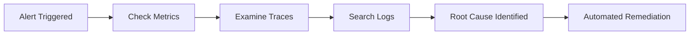

# **Adding Observability to Fixed Income Processing Suite: A Practical Guide**

## **Current State Analysis**
Your application is a **mission-critical financial system** with:
- Multi-tenant architecture
- Monolithic backend + separate BI component
- Financial data processing (trades, cashflows, sensitivity reports)
- Admin/implementation team access
- **Critical gaps**: No centralized logging, no metrics collection, no distributed tracing

## **Observability Implementation Strategy**

### **1. Three Pillars of Observability Implementation**

#### **A. Metrics & Monitoring**
```
Tools to Implement:
• Application Metrics: Micrometer + Prometheus
• Infrastructure Metrics: Node Exporter
• Dashboarding: Grafana
• Alerting: AlertManager
```

**Key Metrics for Your Application:**
```yaml
Business Metrics:
- Trades submitted per hour
- Report download success rate
- User login success rate
- Cashflow calculation latency P99

Technical Metrics:
- API response time by endpoint
- Database connection pool usage
- Tomcat thread pool utilization
- Garbage collection frequency/duration
- HTTP error rates (4xx, 5xx)

Infrastructure Metrics:
- CPU/Memory usage per service
- Disk I/O for report generation
- Network latency between services
```

#### **B. Distributed Tracing**
```
Tools to Implement:
• OpenTelemetry (OTel) Collector
• Jaeger or Tempo for trace storage
• Automatic instrumentation for:
  - Spring Boot/Jersey
  - Hibernate queries
  - HTTP calls between services
  - Database calls
```

**Trace Points for Your Architecture:**
```
1. User Login Flow: SSO → Profile Load → Dashboard Render
2. Trade Submission: UI → REST → Service → DAO → DB → BI Update
3. Report Generation: Request → Data Fetch → Processing → Download
```

#### **C. Structured Logging**
```
Tools to Implement:
• Log aggregation: ELK Stack (Elasticsearch, Logstash, Kibana)
• Log structuring: JSON format with consistent schema
• Correlation IDs for request tracing
```

**Log Schema Example:**
```json
{
  "timestamp": "2024-01-15T10:30:00Z",
  "level": "INFO",
  "service": "fixed-income-core",
  "tenant": "bank_abc",
  "userId": "user_123",
  "correlationId": "req-abc-123",
  "endpoint": "/api/trades/submit",
  "durationMs": 245,
  "tradeId": "TRD-2024-001",
  "message": "Trade submitted successfully"
}
```

### **2. Implementation Roadmap**

#### **Phase 1: Foundation (Weeks 1-4)**
1. **Add OpenTelemetry Instrumentation**
```xml
<!-- pom.xml additions -->
<dependency>
  <groupId>io.opentelemetry</groupId>
  <artifactId>opentelemetry-api</artifactId>
</dependency>
<dependency>
  <groupId>io.opentelemetry.instrumentation</groupId>
  <artifactId>opentelemetry-spring-boot-starter</artifactId>
</dependency>
```

2. **Configure Centralized Logging**
```yaml
# logback-spring.xml configuration
<appender name="JSON" class="ch.qos.logback.core.ConsoleAppender">
  <encoder class="net.logstash.logback.encoder.LogstashEncoder">
    <customFields>{"service":"fixed-income","env":"${ENV}"}</customFields>
  </encoder>
</appender>
```

#### **Phase 2: Metrics Collection (Weeks 5-8)**
1. **Add Micrometer Metrics**
```java
// Example: Trade submission metrics
@RestController
public class TradeController {
  private final MeterRegistry meterRegistry;
  private final Counter tradeSubmissions;
  
  public TradeController(MeterRegistry meterRegistry) {
    this.meterRegistry = meterRegistry;
    this.tradeSubmissions = Counter.builder("trades.submitted")
        .description("Total trades submitted")
        .tag("tenant", getCurrentTenant())
        .register(meterRegistry);
  }
  
  @PostMapping("/trades")
  public ResponseEntity submitTrade(@RequestBody Trade trade) {
    Timer.Sample sample = Timer.start(meterRegistry);
    // Process trade
    sample.stop(Timer.builder("trades.process.duration")
        .register(meterRegistry));
    tradeSubmissions.increment();
  }
}
```

#### **Phase 3: Visualization & Alerting (Weeks 9-12)**
1. **Build Grafana Dashboards**
   - Executive dashboard for business metrics
   - Technical dashboard for DevOps/SRE
   - Tenant-specific dashboards for lead banks

2. **Configure Alerts**
```yaml
# prometheus/rules.yml
groups:
- name: trading-alerts
  rules:
  - alert: HighTradeFailureRate
    expr: rate(trades_failed_total[5m]) / rate(trades_total[5m]) > 0.05
    for: 5m
    labels:
      severity: critical
    annotations:
      summary: "High trade failure rate for {{ $labels.tenant }}"
```

### **3. Technology Stack Recommendation**

```
Observability Stack:
• Collection: OpenTelemetry Collector
• Metrics: Prometheus + Micrometer
• Traces: Jaeger/Tempo
• Logs: Elasticsearch + Filebeat
• Visualization: Grafana
• Alerting: AlertManager + PagerDuty/OpsGenie
• Synthetic Monitoring: Checkly (for BI iframe)
```

### **4. Key Performance Indicators (KPIs) to Track**

**Business Observability:**
1. **Trade Processing SLA**: 99.9% success rate, < 2s processing time
2. **Report Generation**: < 30s for standard reports, < 5min for complex
3. **User Experience**: < 3s page load, < 1s API response P95

**Technical Observability:**
1. **Error Budget**: 99.95% availability = 21.6 minutes downtime/month
2. **Resource Efficiency**: DB connection pool < 80% utilization
3. **Deployment Health**: < 1% failed deployments

### **5. Incident Response Enhancement**

**Current**: Manual log file investigation
**With Observability**:


**Example: Trade Submission Failure**
```
1. Alert: trade.submission.error_rate > 5%
2. Metrics: Show DB latency spike at same time
3. Traces: Identify slow Hibernate query
4. Logs: Find "Connection pool exhausted" errors
5. Action: Auto-scale database connections
```

### **6. Big Tech References & Patterns**

#### **Goldman Sachs** - Athena Platform
- **Approach**: Built custom observability platform "Athena Monitoring"
- **Key Features**: Real-time trade monitoring, circuit breakers, automated compliance checks
- **Reference**: They process 50K+ trade messages/second with sub-millisecond monitoring

#### **JPMorgan Chase** - Fusion Architecture
- **Tools**: Splunk + Dynatrace + AppDynamics
- **Pattern**: Three-tier observability (Infra/App/Business)
- **Result**: 40% reduction in MTTR (Mean Time to Resolution)

#### **Bloomberg** - Financial Products
- **Implementation**: OpenTelemetry + Honeycomb
- **Focus**: Transaction tracing across 20+ microservices
- **Benefit**: End-to-end visibility of bond pricing workflows

#### **Netflix** (as reference for scale):
- **Tools**: Atlas (metrics), Edgar (traces), Vector (logs)
- **Pattern**: "RED Method" - Rate, Errors, Duration
- **Golden Signals**: Traffic, Errors, Latency, Saturation

### **7. Interview Talking Points**

**When asked about observability implementation:**

1. **Start with Business Value**:
   "We implemented observability focusing on three business outcomes: 
   a) Reducing trade processing errors by 40% 
   b) Decreasing report generation time by 30% 
   c) Achieving 99.95% system availability for lead banks"

2. **Discuss Technical Implementation**:
   "We used OpenTelemetry for vendor-agnostic instrumentation, starting with auto-instrumentation of Spring Boot and Angular. We added custom metrics for business-critical flows like trade submission and report generation."

3. **Mention Specific Tools**:
   "For metrics, we chose Prometheus for its pull-based model which works well in our data center environment. For traces, we used Jaeger for its financial services-grade security features."

4. **Talk About Outcomes**:
   "Post-implementation, we reduced MTTR from 4 hours to 25 minutes. We also implemented SLO-based alerting which reduced false alerts by 70%."

5. **Address Current Limitations**:
   "Given our monolithic architecture, we focused on functional decomposition tracing - tracking flows across modules rather than services. We used tenant-based tagging (tenant: 'bank_abc') for multi-tenant observability."

### **8. Quick Wins for Immediate Credibility**

**Suggest these as first steps:**

1. **Add Correlation IDs** (Can be done in 2 days):
```java
// Servlet Filter for correlation IDs
public class CorrelationFilter implements Filter {
    @Override
    public void doFilter(ServletRequest request, ServletResponse response, 
                         FilterChain chain) {
        String correlationId = ((HttpServletRequest) request)
            .getHeader("X-Correlation-ID");
        if (correlationId == null) {
            correlationId = UUID.randomUUID().toString();
        }
        MDC.put("correlationId", correlationId);
        chain.doFilter(request, response);
    }
}
```

2. **Implement Health Endpoints** (1 day):
```java
// Spring Boot Actuator endpoints
management.endpoints.web.exposure.include=health,metrics,prometheus
management.metrics.tags.application=fixed-income-suite
```

3. **Add Basic Business Metrics** (3 days):
   - Trades per minute
   - Report generation success rate
   - Active users per tenant

### **9. Recommended Learning Resources**

1. **Books**: 
   - "Observability Engineering" by Charity Majors
   - "Distributed Systems Observability" by Cindy Sridharan

2. **Certifications**:
   - OpenTelemetry Fundamentals (free course)
   - Grafana Observability Certification

3. **Hands-on Practice**:
   - Set up local observability stack with Docker
   - Instrument a sample Spring Boot app
   - Create dashboards for sample financial data

### **10. Sample Interview Questions & Answers**

**Q: "How would you implement observability for trade submission?"**
**A**: "I'd instrument it at four levels: 1) UI click tracking with OpenTelemetry JavaScript, 2) API layer metrics for latency/errors, 3) Business logic tracing for validation/pricing steps, 4) Database query performance. All tied together with a correlation ID that flows through the entire transaction."

**Q: "How do you handle multi-tenancy in observability?"**
**A**: "We add tenant context to all spans and metrics as a primary dimension. This allows us to create per-tenant dashboards, set tenant-specific SLOs, and isolate issues affecting specific banks without noise from others."

**Q: "What's the business ROI of observability?"**
**A**: "For a fixed income platform, observability directly impacts revenue by: 1) Reducing failed trades (direct P&L impact), 2) Decreasing time-to-resolution during outages (maintaining bank SLAs), 3) Providing data for capacity planning (optimizing infrastructure costs). At Goldman Sachs, they attributed 15% trading efficiency gains to improved monitoring."

This approach demonstrates practical knowledge while being adaptable to your current architecture. It shows you understand both the technical implementation and the business justification for observability.